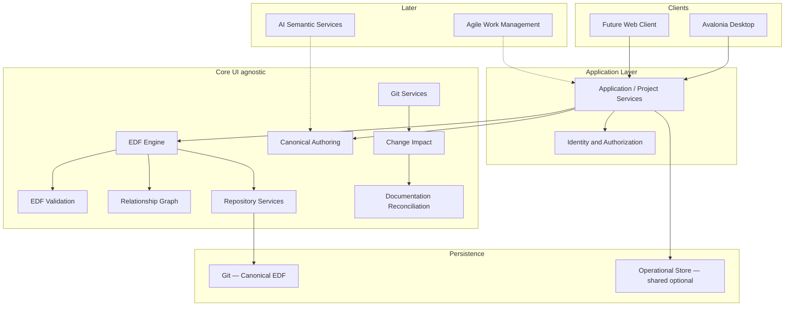

[Home](../../README.md) › [Project Index](../../PROJECT_INDEX.md) › [Architecture](README.md) › System Architecture Overview

# System Architecture Overview

> **Status:** Draft — [EGR-G0](../../Program/Gate_Reviews/EGR-G0-Architecture-Planning-Gate.md) **Satisfied** (2026-09-15)  
> **Owner:** ProjectConcord  
> **Applies To:** EDF Project Management System  
> **Last Reviewed:** 2026-09-15 (multi-user amendments)  
> **Authoritative:** Yes

## Purpose

Define the technical architecture for ProjectConcord: a cross-platform desktop-first client that interprets, validates, navigates, and authors EDF-managed repositories without replacing EDF as canonical source of truth. Derived from [PCON-0000](PCON-0000-EDF-Project-Management-System-Architectural-Vision-and-Bootstrap-Handover.md), [AMD-0001](AMD-0001-Multi-User-Desktop-and-Shared-Project-Services.md), [AMD-0002](AMD-0002-Single-User-Administrator-Model.md), and aligned with accepted/proposed ADRs.

**Current product principle (supersedes PCON-0000 single-user-first wording):** ProjectConcord is a **multi-user engineering project-management platform** whose first client is a native desktop application. Multiple authenticated users may participate in shared projects through shared project services and operational data; a future web client joins the same services ([ADR-0009](ADRs/ADR-0009-Multi-User-Platform-and-Shared-Project-Services.md)).

## Scope

### In scope

- Layered component model (desktop client, application services, EDF Engine, repository/Git)
- MVP vs deferred capabilities
- EDF version/profile interpretation strategy
- Validation, authoring, graph, reconciliation (design)
- Testing approach
- Desktop-to-web evolution constraints

### Out of scope

- Detailed UI mockups
- Mandatory CRA/CKES runtime services for MVP ([ADR-0008](ADRs/ADR-0008-CRA-and-CKES-Dependency-Boundary.md))
- Production deployment topology

---

## Architectural Context



**Principle:** EDF repository artifacts remain canonical. The application provides interpretation, validation, navigation, authoring assistance, collaboration, and derived analysis ([ADR-0002](ADRs/ADR-0002-EDF-Canonical-Source-of-Truth.md), [ADR-0009](ADRs/ADR-0009-Multi-User-Platform-and-Shared-Project-Services.md)).

---

## Multi-User Platform Foundation

| Concern | Rule |
|---|---|
| Clients | Desktop first; web is another client of the same application services |
| Authorization | Project membership and roles enforced in application layer; EDF Engine stays auth-agnostic where practical |
| Solo projects | Creating user is default **Administrator** with full project permissions ([ADR-0010](ADRs/ADR-0010-Single-User-Administrator-Default-Model.md)) |
| Canonical data | SPECs, ADRs, gates, and other EDF-prescribed artifacts remain in Git |
| Operational data | Membership, audit, notifications, change-set metadata, shared derived indexes MAY use an operational store |
| UI coupling | Clients MUST NOT talk directly to operational DB; use project services ([AMD-0001](AMD-0001-Multi-User-Desktop-and-Shared-Project-Services.md) §14) |
| Personas | UI workspaces/dashboards are not authorization roles; Administrators may use all perspectives without role spam |
| EDF gates | Independent review required by EDF/EGR is not bypassed by Administrator privilege |

**MVP phasing:** M1–M5 ([SPEC-001](../Specifications/features/SPEC-001-mvp-edf-desktop-client.md)) delivers local EDF discovery, validation, navigation, and authoring. Implementation MAY use a single-member project and local-only operational persistence, but assemblies and APIs MUST reflect the multi-user model (no forked “single-user mode”).

**Post-MVP:** Shared project services, membership, basic roles, shared operational database, controlled repository access, and concurrent-change detection — sequenced in [Implementation Roadmap](../Development/Implementation_Roadmap.md).

---

## Solution Structure

Illustrative .NET layout (assemblies may be merged if boundaries stay clear):

```text
ProjectConcord.sln
src/
    Edf.Domain/           # Semantic model, value types, artifact IDs
    Edf.Engine/           # Discovery, classification, profile resolution
    Edf.Validation/       # Script invocation + in-process rules
    Edf.Authoring/        # CRUD, templates, lifecycle guards
    Edf.Relationships/    # Link graph, inferred edges
    Edf.Repository/       # Filesystem abstraction
    Edf.Git/              # Git status, diff, blame (LibGit2Sharp or similar)
    Edf.ChangeAnalysis/   # Change summaries (Roslyn later)
    Edf.Integrity/          # Layered integrity, transitions, external change (M5+)
    Edf.Application/      # Use cases orchestrating Engine + UI-agnostic APIs
    Edf.ProjectServices/  # Membership, roles, change sets, operational persistence (M1: interfaces/stubs)
    Edf.Identity/         # Auth abstractions; local degenerate case for MVP
    Edf.Desktop/          # Avalonia shell, views, view models
tests/
    Edf.Engine.Tests/
    Edf.Validation.Tests/
    Edf.Integration.Tests/  # Fixture EDF repos
```

| Assembly | Responsibility |
|---|---|
| `Edf.Domain` | `Project`, `Artifact`, `Profile`, `ConformanceReport`, relationship types |
| `Edf.Engine` | Open project root, resolve capabilities, scan artifacts |
| `Edf.Validation` | Run EDF shell tools; parse output ([ADR-0003](ADRs/ADR-0003-EDF-Validation-Strategy.md)) |
| `Edf.Authoring` | Create/edit SPEC/ADR from templates; safe save paths |
| `Edf.Relationships` | Parse Markdown links → graph with confidence |
| `Edf.Repository` | IFileSystem, path guards, watch (optional) |
| `Edf.Git` | Detect changes; no full Git client |
| `Edf.Application` | Commands/queries for desktop and future API |
| `Edf.ProjectServices` | Project membership, roles, operational store, change-set coordination ([ADR-0009](ADRs/ADR-0009-Multi-User-Platform-and-Shared-Project-Services.md)) |
| `Edf.Identity` | Authentication/authorization abstractions; Engine remains policy-agnostic |
| `Edf.Desktop` | Avalonia only — no EDF rules here |

Core EDF logic MUST NOT depend on Avalonia (PCON-0000 §4, §54.8).

---

## Semantic Project Model

### MVP entities

| Entity | Source | MVP |
|---|---|---|
| Project | Root + adoption files | Yes |
| Project Profile / Capabilities | YAML | Yes |
| Artifact | Markdown/YAML under `docs/` | Yes |
| Architecture Decision (ADR) | `docs/Architecture/ADRs/` | Discover |
| Specification (SPEC) | `docs/Specifications/` | Discover + author (M5) |
| Watch Item (AWI) | `docs/Architecture/Watch_Items/` | Discover |
| Discovery Record | `docs/Architecture/` (e.g. PCON-0000) | Discover |
| Conformance Report | Framework Advisor output | Yes (M3) |

### Deferred entities

Milestone, Gate, Validation Evidence, Acceptance Record, Sprint, Task — require EDF taxonomy or project extensions ([EDF Gap Register](../Development/EDF_Gap_Register.md) GAP-006, GAP-007).

Engine exposes semantic APIs (PCON-0000 §7), e.g. `GetProjectProfile()`, `GetArtifacts()`, `GetConformanceSummary()`, not raw directory walks in UI.

---

## EDF Version and Profile Interpretation

1. **Project root** — user selects filesystem path ([ADR-0005](ADRs/ADR-0005-Repository-Abstraction.md)).
2. **Adoption config** — read `edf-adoption.yaml` (`profile`) and `edf-project-context.yaml` (`capabilities`, `legacy_profile`, `repository_role`).
3. **Framework reference** — user settings: path to local EDF clone; Engine invokes scripts from that path (GAP-002).
4. **Required directories** — resolve using same rules as EDF `edf_profile.sh` (ported or subprocess).
5. **Never hard-code** a single layout as “the” EDF (PCON-0000 §9).

---

## Validation

| Layer | Mechanism |
|---|---|
| Primary | Invoke `run_conformance_validation.sh` / `analyze_project_structure.sh` against project root with configured EDF path |
| Secondary | In-process checks where unambiguous (broken relative links, SPEC/ADR filename patterns) |
| Non-goal | Reimplement entire Framework Advisor in C# before M3 proves script wrapping |

Parse text output initially; contribute JSON format to EDF when stable (GAP-010).

---

## Conformance and review artifacts

| Artifact | Evaluates | Location |
|---|---|---|
| **EGR** | Human approval of authoritative **documents** | [docs/Program/Gate_Reviews/](../../Program/Gate_Reviews/) |
| **AAR** | **Implementation** vs Accepted ADRs / normative SPECs | [docs/Architecture/Audits/](Audits/README.md) ([ADR-0012](ADRs/ADR-0012-Adopt-EDF-Architectural-Audit-Records.md), EDF [AAR-0001](https://github.com/edbecnel/Engineering-Documentation-Framework/blob/main/docs/Specifications/AAR-0001-Architectural-Audit-Records.md)) |
| **Framework Advisor** | **Documentation** structure and navigation | `reports/conformance/` (transient) |
| **Operational audit** | Collaboration / integrity **events** (not AAR) | Operational store per [ADR-0009](ADRs/ADR-0009-Multi-User-Platform-and-Shared-Project-Services.md) |

Post-M5, the Engine MAY discover EGR and AAR Markdown files for dashboard display (GAP-006, GAP-026).

### Governed Dependency Override (GDO)

EDF [EGR-0001 v1.1](https://github.com/edbecnel/Engineering-Documentation-Framework/blob/main/docs/Specifications/EGR-0001-Engineering-Gate-Review-Records.md) defines **Governed Dependency Override**: a source gate may remain **Open** while a named downstream activity is **Non-Blocking** only when an **Active** GDO is recorded on the source EGR. ProjectConcord MUST NOT collapse these into a single status field:

| Dimension | Role |
|---|---|
| **Gate Status** | Lifecycle of the gate obligation (Open, Satisfied, …) |
| **Dependency Disposition** | Blocking vs Non-Blocking for a **specific** downstream activity |
| **Override Status** | Lifecycle of the GDO row (Active, Reactivated, Closed) |

Normative semantics and consumption guidance: [GDO handover](../Handover/EDF-Governed-Dependency-Override-Architecture-Handover.md) ([GAP-040](../Development/EDF_Gap_Register.md)). **GDO** governs **program gate prerequisite blocking**; it is distinct from AI-governance **handover** packages and **DevelopmentWorkAuthorization** ([SPEC-004](../Specifications/features/SPEC-004-ai-assisted-development-governance-workflow.md)). When citing EDF gate decisions, use **EDF ADR-0007** — not ProjectConcord [ADR-0007](ADRs/ADR-0007-Semantic-Artifact-Identity-and-Referential-Integrity.md).

---

## Canonical Authoring and Lifecycle

- **Authoring** — structured forms driven by EDF templates; emit canonical Markdown to prescribed paths (M5: one artifact type, SPEC).
- **Integrity-aware authoring** — governed field changes SHOULD use semantic operations where [SPEC-003](../Specifications/features/SPEC-003-canonical-artifact-integrity-and-authorized-state-transitions.md) applies ([ADR-0011](ADRs/ADR-0011-Canonical-Artifact-Integrity-and-Trusted-State.md)).
- **Raw Markdown** — supported for power users; validation on save (PCON-0000 §15).
- **Lifecycle** — status values from templates; warn on unknown; no silent deletion — archive pattern per DIA.
- **Move/rename** — user-initiated; scan inbound/outbound links; update indexes when user confirms.

---

## Canonical Integrity Pipeline

Normative behavior: [SPEC-003](../Specifications/features/SPEC-003-canonical-artifact-integrity-and-authorized-state-transitions.md). Decision: [ADR-0011](ADRs/ADR-0011-Canonical-Artifact-Integrity-and-Trusted-State.md).

```text
StructuralIntegrity
        |
        v
SemanticStructuralIntegrity
        |
        v
RelationshipAndLifecycleIntegrity  <-- SPEC-002 registry/index feeds this layer
        |
        v
AuthorizationIntegrity             <-- roles / EGR independent review
        |
        v
EngineeringIntentConsistency       <-- M7+ reconciliation (separate concern)
```

| Service (illustrative) | Role |
|---|---|
| `IntegrityService` | Orchestrate layered checks; artifact integrity status |
| `TransitionEvaluator` | Governed lifecycle operations vs raw text edits |
| `ExternalChangeMonitor` | Git/filesystem baseline; classify external deltas |
| `TrustedIntegrityStore` | Operational fingerprints and trust records ([ADR-0009](ADRs/ADR-0009-Multi-User-Platform-and-Shared-Project-Services.md)) |

**Multi-user:** Shared project services validate concurrent changes against the same integrity model before treating operational state as trusted ([SPEC-003](../Specifications/features/SPEC-003-canonical-artifact-integrity-and-authorized-state-transitions.md) §38–§39). Change-set coordination aligns with [AMD-0001](AMD-0001-Multi-User-Desktop-and-Shared-Project-Services.md).

## Relationship Graph

Normative behavior: [SPEC-002](../Specifications/features/SPEC-002-canonical-artifact-relationships-referential-integrity.md). Decision: [ADR-0007](ADRs/ADR-0007-Semantic-Artifact-Identity-and-Referential-Integrity.md). Lifecycle authorization and trusted state: [SPEC-003](../Specifications/features/SPEC-003-canonical-artifact-integrity-and-authorized-state-transitions.md).

Derived from:

- Stable artifact IDs (ADR, SPEC, AWI, EGR, …) resolved to current paths via Artifact Registry
- Relative Markdown links and domain README indexes
- Optional metadata tables (Status, Spec ID)

Edges tagged **explicit** (link), **inferred** (index listing), or **semantic** (typed relationship when EDF or user confirms). Used for navigation, move/rename impact analysis, and reconciliation hints — not automatic lifecycle changes.

Stored in derived cache ([ADR-0004](ADRs/ADR-0004-Derived-Data-and-Cache.md)).

---

## Git Integration and Reconciliation

### Design (full vision)

Triad (PCON-0000 §25):

```text
EDF Intent  ←→  Code Changes  ←→  Validation Evidence
```

1. **Git Services** — detect changed files since baseline (commit or session).
2. **Change Impact** — map code paths to specs/ADRs via conventions + graph (later Roslyn summaries).
3. **Reconciliation** — propose doc updates; **human approval required** before canonical writes (PCON-0000 §29).
4. Code does **not** override accepted architecture automatically.

### MVP slice

After M5: read-only “files changed” + link to related SPECs if path/heuristic match. Full reconciliation workflow M6+.

---

## AI Boundary

- AI generates **proposals** only ([ADR-0006](ADRs/ADR-0006-AI-Boundary.md)).
- Deterministic validation runs before save.
- User approves canonical writes.
- Economical AI: structured prompts with minimal context (PCON-0000 §20).

---

## Agile Boundary

Optional work management (PCON-0000 §32) is **not** canonical EDF unless a future capability defines it. Deferred past MVP.

---

## Desktop-to-Web Evolution

Multi-user operation precedes the web client ([ADR-0009](ADRs/ADR-0009-Multi-User-Platform-and-Shared-Project-Services.md)). Web v1 reuses application and project services; it does not introduce multi-user semantics for the first time.

| Component | Web v1 expectation |
|---|---|
| `Edf.Domain`, `Edf.Engine`, `Edf.Validation`, `Edf.Authoring`, `Edf.Relationships` | Reuse unchanged |
| `Edf.Repository` | Adapt backend (filesystem → server-side repo clone) |
| `Edf.Application` | Expose as ASP.NET Core API |
| `Edf.Desktop` | Replace with web UI |
| Authentication | Application/Identity layer; Engine stays auth-agnostic |

**Success criterion:** Web client does not require rewriting validation or EDF interpretation rules.

---

## CRA, CKES, and EDF Boundaries

Normative for ProjectConcord: [CRA Alignment and Responsibility Boundaries](CRA_Alignment_and_Responsibility_Boundaries.md).

```text
CRA  →  foundational canonical representation (consume, do not redefine)
EDF  →  engineering documentation semantics (canonical repo artifacts)
ProjectConcord  →  operational UI, Engine, derived indexes
```

- [SPEC-002](../Specifications/features/SPEC-002-canonical-artifact-relationships-referential-integrity.md) implements referential integrity at the EDF application layer.
- [ADR-0008](ADRs/ADR-0008-CRA-and-CKES-Dependency-Boundary.md) — no mandatory CKES/CRA service for MVP.
- EDF framework reference: [CRA_CKES_EDF_Boundaries](https://github.com/edbecnel/Engineering-Documentation-Framework/blob/main/docs/Architecture/CRA_CKES_EDF_Boundaries.md).

---

| Level | Focus |
|---|---|
| Unit | Profile resolution, artifact classification, parsers |
| Integration | Open fixture repo (minimal EDF tree + EDF clone path); compare validation output to golden script output |
| UI | Smoke tests on desktop (later) |

Fixture repos under `tests/fixtures/` (created at M1/M2).

---

## Security Notes (phased)

- **M1–M5 (SPEC-001):** Local desktop MVP MAY use simplified auth (single default Administrator, local operational cache). Network identity federation is out of scope.
- **Platform:** Authentication, project membership, and role checks apply at application/project-service boundary before canonical writes ([ADR-0009](ADRs/ADR-0009-Multi-User-Platform-and-Shared-Project-Services.md)).
- AI API keys in OS secure storage when AI milestone arrives.
- Script invocation: validate paths; no shell injection from repo content.

---

## Related Decisions

| ADR | Topic |
|---|---|
| [ADR-0001](ADRs/ADR-0001-Layered-Architecture-and-Avalonia-Client.md) | Layers and Avalonia |
| [ADR-0002](ADRs/ADR-0002-EDF-Canonical-Source-of-Truth.md) | Canonical vs derived |
| [ADR-0003](ADRs/ADR-0003-EDF-Validation-Strategy.md) | Validation |
| [ADR-0004](ADRs/ADR-0004-Derived-Data-and-Cache.md) | Caches |
| [ADR-0005](ADRs/ADR-0005-Repository-Abstraction.md) | Repository |
| [ADR-0006](ADRs/ADR-0006-AI-Boundary.md) | AI |
| [ADR-0007](ADRs/ADR-0007-Semantic-Artifact-Identity-and-Referential-Integrity.md) | Referential integrity |
| [ADR-0008](ADRs/ADR-0008-CRA-and-CKES-Dependency-Boundary.md) | CRA/CKES dependency |
| [ADR-0009](ADRs/ADR-0009-Multi-User-Platform-and-Shared-Project-Services.md) | Multi-user platform |
| [ADR-0010](ADRs/ADR-0010-Single-User-Administrator-Default-Model.md) | Administrator default |
| [ADR-0011](ADRs/ADR-0011-Canonical-Artifact-Integrity-and-Trusted-State.md) | Canonical integrity and trusted state |
| [ADR-0012](ADRs/ADR-0012-Adopt-EDF-Architectural-Audit-Records.md) | Adopt EDF AAR |

---

## Parent

- [Architecture](README.md)

## Related Documents

- [AMD-0001 — Multi-User Amendment](AMD-0001-Multi-User-Desktop-and-Shared-Project-Services.md)
- [Multi-User Amendment Analysis](Multi_User_Amendment_Affected_Document_Analysis.md)
- [SPEC-001 MVP](../Specifications/features/SPEC-001-mvp-edf-desktop-client.md)
- [SPEC-003 Integrity](../Specifications/features/SPEC-003-canonical-artifact-integrity-and-authorized-state-transitions.md)
- [EDF Gap Register](../Development/EDF_Gap_Register.md)
- [Implementation Roadmap](../Development/Implementation_Roadmap.md)
