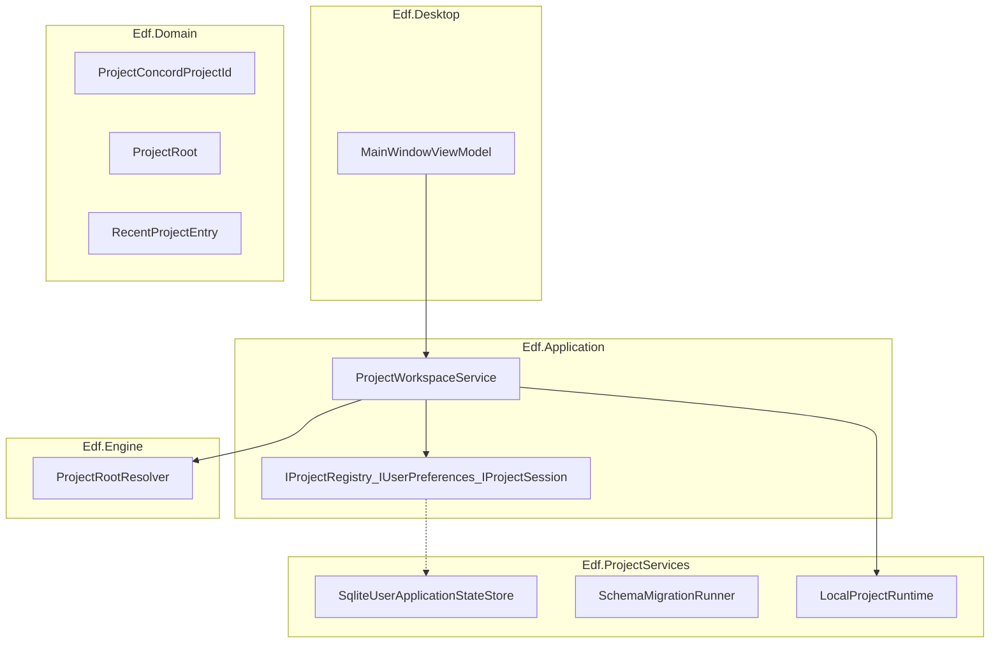
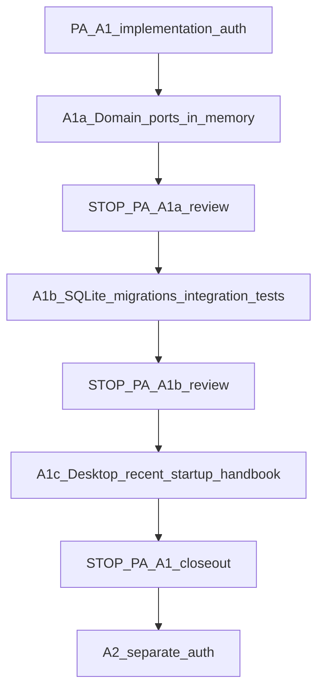

[Home](../../README.md) › [Project Index](../../PROJECT_INDEX.md) › [Handover](README.md) › ProjectConcord A1 Implementation Plan

# ProjectConcord A1 — Implementation Plan

**Tranche:** PAR track **A1** — Project identity, Project Root lifecycle, per-user application state, Recent Project Roots

**Mode:** PLAN only — **no A1 implementation authorized** by this document

**Architecture basis (closed):** [PAR Workflow Architecture Plan](ProjectConcord-PAR-Workflow-Architecture-Plan.md) (A0 **PA accepted**), [SPEC-006](../Specifications/features/SPEC-006-par-project-root-and-governed-workflow-relay.md), [ADR-0015](../Architecture/ADRs/ADR-0015-Project-Identity-PAR-and-Per-User-Operational-State.md) (**Proposed**)

**Implementation baseline:** `c08af261ff323a0ddd54a84bd5c8b990a49fa84f` (M1 skeleton; AAR-0001 Finding 14 intentional deferral)

**Governance:** M2 **not authorized**; A2–A4 **not authorized**; STOP-2 **binding**; ADR-0013/0014 **Proposed**

---

## Project Architect disposition

| Item | Status |
|------|--------|
| A0 architecture | **CLOSED / PA ACCEPTED** |
| **This A1 plan** | **FINAL ACCEPTED** (2026-09-28) |
| **A1 overall** | **IN PROGRESS** |
| **A1a** | **IMPLEMENTED / PA ACCEPTED / PUBLISHED** (2026-09-28; baseline `34f10686bae84b0eb0bf129361c2e10b6e267886`) |
| **A1b** | **IMPLEMENTED / PA ACCEPTED / PUBLISHED** (2026-09-28; see A1b publication commit on `main`) |
| **A1c** | **IMPLEMENTED / PA ACCEPTED / PUBLISHED** (2026-09-28; see A1c publication commit on `main`) |
| **ADR-0015** at A1 closeout | Provide conformance evidence only; **PA issues lifecycle disposition separately** — A1 does **not** auto-Accept ADR-0015 |

---

## Recorded PA decisions (PA-A1-1 – PA-A1-8)

| ID | Disposition |
|----|-------------|
| **PA-A1-1** | **ACCEPT** — No auto-open last active project. Startup: show Recent Projects; highlight/identify last-active when appropriate; **explicit user action** required to open/select a Project Root. |
| **PA-A1-2** | **AMEND** — Unregistered path → **new** ProjectConcord Project ID by default. Do **not** auto-equate Git repo, clone, copy, move, or identity hint with existing Project ID. Reconciliation preserving ID requires **explicit user action**. |
| **PA-A1-3** | **ACCEPT** (clarified) — Never auto-merge projects on identity hint. Hints are **advisory only** if used later; they do **not** establish ProjectConcord identity. |
| **PA-A1-4** | **AMEND** — A1 implements explicit **Relocate Project…** on Recent entry (missing locator): user selects new root → validate → `ReconcileProjectLocator(projectId, newAbsolutePath)` updates locator for **same** Project ID. **No** automatic or prompt-on-open fingerprint reconciliation in A1. Heuristic reconciliation **deferred**. |
| **PA-A1-5** | **ACCEPT** — Max Recent Projects = **10** (application policy/config, not schema semantics). Remove from Recent removes recent-list membership only; **managed-project registry row remains**. |
| **PA-A1-6** | **ACCEPT** — Minimal **Close Project** in A1c: clears active Project Root/session only; does **not** delete Project ID, registry, Recent history, or create project-local state. |
| **PA-A1-7** | **AMEND** — Do **not** pre-authorize ADR-0015 Accept. At A1 closeout, supply implementation/conformance evidence; PA dispositions ADR-0015 separately. |
| **PA-A1-8** | **ACCEPT** — Create **`Edf.ProjectServices.Tests`** for SQLite, migrations, and ProjectServices infrastructure; Application behavior tests stay in **`Edf.Application.Tests`**. |

---

## Project identity invariant (binding)

**`ProjectConcordProjectId` is the stable logical identity.**

The following are **locators or observations** and MUST **not** independently redefine that identity:

- filesystem path
- directory name
- Git repository
- Git common directory
- Git remote URL
- repository clone
- display name

**Normal model (A1):** Project ID → registered **current Project Root locator path** (persisted). Reopen at that path preserves the ID after filesystem validation.

**Relocation:** Explicit **Relocate Project…** updates the locator associated with an **existing** Project ID.

**Open Project** at an unregistered path creates a **new** Project ID.

---

## 1. Exact scope

### 1.1 In scope (A1 only)

| # | Capability | SPEC-006 / ADR-0015 |
|---|------------|---------------------|
| 1 | Stable **ProjectConcord Project ID** (new projects, reopen, reconciliation) | PC-PAR-001, 004; ADR-0015 §1 |
| 2 | **Project Root** open / switch / close session context | PC-PAR-002, 005–006 |
| 3 | Per-user **SQLite** persistence (OS app data) | PC-PAR-009–010; ADR-0015 §2 |
| 4 | **Recent Project Roots** (per-user, not Git) | PC-PAR-007–008 |
| 5 | Project ID ↔ current locator association | PC-PAR-004, 008 |
| 6 | Missing / moved / stale locator handling | PC-PAR-004 |
| 7 | **Startup** behavior (no recent / has recent / missing last root) | PC-PAR-005 |
| 8 | Schema **versioning / migrations** foundation | PC-PAR-010 |
| 9 | **Persistence ports** for later PAR (no PAR runtime) | ADR-0015 §4 layering |
| 10 | **Tests** proving the above | Plan §12 |

### 1.2 Explicit non-goals (out of A1)

- PAR runtime, PA packages, handover import, governed workflow execution
- `IProjectArchitectProvider`, ChatGPT adapter, any AI API
- `CursorBridge`, Cursor extension/CLI/MCP/ACP
- A2, A3, A4
- M2 EDF discovery, validation, parsing
- `.projectconcord/` creation or any project-local ProjectConcord state
- Tier 0 canonical Markdown awareness beyond optional **display name** from directory name
- Git remote URL / Git fingerprint as identity mechanism (**deferred**; not A1)
- `RepositoryIdentityHint` / Git common-directory fingerprinting (**deferred / not required for A1**)
- Automatic or heuristic project reconciliation on open
- ADR-0015 **Accept** or ADR-0013 **Accept** at A1 closeout (separate PA gate — see PA-A1-7)

---

## 2. Requirements traceability (A1 subset)

| SPEC-006 | A1 implementation |
|----------|-------------------|
| PC-PAR-001–004 | Project registry + identity lifecycle |
| PC-PAR-005–008 | Workspace + recent list + startup |
| PC-PAR-009–011 | SQLite store + no canonical EDF in DB |
| PC-PAR-012–022 | **None** — deferred to A2+ |
| ADR-0015 §1–3 | Identity + SQLite direction + no `.projectconcord/` on open |
| ADR-0009 | Operational data in app store, not Git |
| ADR-0004 | No derived repo folder in A1 |

---

## 3. Current-code findings

| Component | Location | A1 disposition |
|-----------|----------|----------------|
| `ProjectRoot` | `Edf.Domain/Projects/ProjectRoot.cs` | **Retain** — value object for validated locator |
| `ProjectRootResolver` | `Edf.Engine/Projects/ProjectRootResolver.cs` | **Retain** — path normalization + existence |
| `ProjectWorkspaceService` | `Edf.Application/Projects/ProjectWorkspaceService.cs` | **Extend** — orchestrate registry + persistence on open/switch |
| `IProjectWorkspaceService` | `Edf.Application/Projects/IProjectWorkspaceService.cs` | **Extend** — current project ID, recent list query, close/switch |
| `OpenProjectResult` | `Edf.Application/Projects/OpenProjectResult.cs` | **Extend** — include `ProjectConcordProjectId` on success |
| `ILocalProjectRuntime` | `Edf.ProjectServices/Local/ILocalProjectRuntime.cs` | **Evolve** — hold **session** context for open project (ID + root); still **no** `.projectconcord/` |
| `LocalProjectRuntime` | stub | **Implement** session fields only |
| `Edf.ProjectServices` | empty `.csproj` | **Add** SQLite infrastructure + port implementations; reference `Edf.Domain` only |
| `MainWindowViewModel` | open-folder only | **Minimal A1 UI** — recent list, open, reopen, remove-from-recent, status for missing paths |
| Tests | `ProjectWorkspaceTests.cs` | **Extend** — in-memory fakes in `Edf.Application.Tests`; SQLite/migrations in **`Edf.ProjectServices.Tests`** (PA-A1-8) |

**Layering today:** `Edf.ProjectServices` has **no** project references — correct seam for SQLite. **Domain** and **Application** must not reference `Microsoft.Data.Sqlite`.

---

## 4. Proposed architecture



### 4.1 Domain types (new / extended)

| Type | Responsibility |
|------|----------------|
| `ProjectConcordProjectId` | Opaque stable ID (UUID string or `Guid`); equality; parse/format |
| `ProjectLocator` | Normalized absolute **registered locator path** (persisted) |
| `LocatorAvailability` | **Derived** at read/open time (`Available`, `MissingOnDisk`) — see §5.2 |
| `ManagedProject` | `ProjectId`, `DisplayName`, `RegisteredLocatorPath`, `LastOpenedUtc` |
| `RecentProjectEntry` | `ProjectId`, `DisplayName`, `RegisteredLocatorPath`, **derived** `LocatorAvailability`, `LastOpenedUtc`, `IsLastActive` (UI) |
| `RepositoryIdentityHint` | **DEFERRED** — not in A1 domain/schema; future advisory only if ever added |

**Not in Domain:** SQLite types, PAR types, Git library types, persisted locator “status”.

### 4.2 Application ports (PAR-ready, A1-minimal)

| Port | Methods (illustrative) |
|------|------------------------|
| `IProjectRegistry` | `RegisterNewProjectAtLocator`, `ResolveByRegisteredLocator`, `ReconcileProjectLocator`, `GetById`, `ListRecent`, `RemoveFromRecent`, `SetDisplayName` |
| `IUserPreferencesStore` | `GetLastActiveProjectId`, `SetLastActiveProjectId` |
| `IUserApplicationStateUnitOfWork` | Transaction boundary for registry + preferences (optional facade) |

PAR (A2+) depends on **`IProjectRegistry`** / project-scoped stores keyed by `ProjectConcordProjectId` — not on SQLite types.

### 4.3 `ILocalProjectRuntime` / session

- **Retain** interface in `Edf.ProjectServices.Local`.
- **Add** `ICurrentProjectSession` (Application or Domain): nullable `ProjectConcordProjectId` + `ProjectRoot` when open.
- `ProjectWorkspaceService` updates session on successful open/switch; **clears on Close Project** (PA-A1-6).
- **Does not** create `.projectconcord/` or touch repository files.

### 4.4 Repository identity hint — deferred (not A1)

Git/common-directory fingerprinting (including SHA-256 of Git common dir path) is **path-derived** and **not** durable repository or ProjectConcord identity. **Not part of minimum A1.**

`RepositoryIdentityHint` remains an optional future **advisory** concept only (PA-A1-2, PA-A1-3). **No** `GitDirectoryFingerprintCalculator` or hint columns in A1 schema.

---

## 5. Persistence

### 5.1 Location

| Platform | Path (convention) |
|----------|-------------------|
| macOS | `~/Library/Application Support/ProjectConcord/user-state.db` (or `state.db` under app folder) |
| Linux | `$XDG_DATA_HOME/ProjectConcord/user-state.db` |
| Windows | `%LOCALAPPDATA%/ProjectConcord/user-state.db` |

Document in [Developer Handbook](../Developer_Handbook/01_Development_Environment.md) on A1 implementation.

**Not** inside opened repository.

### 5.2 Schema (version 1 — planning)

`schema_info`

| column | type |
|--------|------|
| `version` | INTEGER PK |

`managed_projects`

| column | type |
|--------|------|
| `project_id` | TEXT PK (UUID) |
| `display_name` | TEXT NOT NULL |
| `locator_path` | TEXT NOT NULL — **registered** Project Root locator (not canonical identity) |
| `created_utc` | TEXT NOT NULL |
| `last_opened_utc` | TEXT NOT NULL |

**Not persisted in A1:** `locator_status`, `repository_identity_hint` (see §5.2.1).

`recent_projects`

| column | type |
|--------|------|
| `project_id` | TEXT PK FK → managed_projects |
| `sort_order` | INTEGER NOT NULL (0 = most recent) |

`user_preferences`

| column | type |
|--------|------|
| `key` | TEXT PK |
| `value` | TEXT |

Keys: `last_active_project_id`

**Indexes:** UNIQUE on `locator_path` among `managed_projects` (one registered project per path for **Open Project** registration).

#### 5.2.1 Locator availability (derived — binding)

Filesystem existence is **externally mutable** and is **not** canonical Project identity state.

| Rule | Behavior |
|------|----------|
| **Persist** | `locator_path` only |
| **Derive** | `LocatorAvailability` via `Directory.Exists` (or equivalent) when loading Recent Projects, on startup refresh, and **immediately before** open/reopen/relocate validation |
| **Forbidden** | A stale cached Missing/Active flag **overriding** live filesystem validation |
| **Optional cache** | If UI caches availability for performance, treat as **DERIVED/CACHED**; refresh on list load, app activate, and pre-open |

### 5.3 Versioning and migrations

- `SchemaVersion` constant in ProjectServices; `schema_info.version` checked on open.
- Forward-only migrations (`Migration001Initial`, …) in `Edf.ProjectServices/Persistence/Migrations/`.
- Unknown newer schema → fail with clear error (no silent downgrade).

### 5.4 Transactions

- Open project: resolve/create project + update recent order + last_active in **one transaction**.
- Remove from recent: delete `recent_projects` row only; **retain** `managed_projects` for future operational partitions.

### 5.5 Failure / corruption (A1)

| Condition | Behavior |
|-----------|----------|
| DB missing | Create with migration 1 |
| Migration failure | Fail startup; surface actionable message |
| Corrupt SQLite | Fail; offer path to DB file in logs/handbook; **no** silent delete |
| Locator missing on disk | Derived `MissingOnDisk`; open/reopen fails; user uses **Relocate Project…** or removes from recent |
| Open fails validation | Do not update recent / last_active |

Backup/restore: **document** manual copy of `user-state.db`; automated backup **out of A1**.

### 5.6 Testability

- **Application tests:** `InMemoryProjectRegistry` implementing ports.
- **ProjectServices tests:** temp-file SQLite + real migrations.
- Desktop: manual smoke only unless PA requests UI tests later.

---

## 6. Project ID lifecycle

| Scenario | Planned behavior | Notes |
|----------|------------------|-------|
| **First open** at path P (unregistered) | **New** `ProjectConcordProjectId`; register `locator_path` = P; add to recent | PA-A1-2 |
| **Normal reopen** at registered P | Resolve by `locator_path` → same ID; validate path exists; update `last_opened_utc` | Identity invariant |
| **Open Project** at P already registered to another ID | **Fail** or PA-directed UX — unique `locator_path` index | One ID per registered path |
| **Path rename / move** (old P gone) | Registered path unchanged in DB until relocate; **derived** missing on disk; Recent shows unavailable | No auto-new-ID on open at P′ |
| **User opens unregistered P′** after move | **New** Project ID (default) — **not** linked to old project | PA-A1-2 |
| **Relocate Project…** | Same Project ID; `ReconcileProjectLocator` updates `locator_path` to P′ | PA-A1-4 |
| **Repository copy / clone** at new path | **New** Project ID on normal Open Project | Git identity ≠ ProjectConcord ID |
| **Deleted repository** | Derived missing; reopen fails; Relocate or remove from recent | |
| **Identity hints** | **Not used in A1** | Deferred |

### 6.1 Relocation (explicit only — PA-A1-4)

**API:** `ReconcileProjectLocator(projectId, newAbsolutePath)`:

1. Validate `newAbsolutePath` exists (filesystem).
2. Ensure path not already registered to a **different** `project_id` (or PA-directed conflict UX).
3. Update `managed_projects.locator_path` for **same** `project_id`.
4. Refresh recent order / last_opened as appropriate.

**UI:** Recent Project → **Relocate Project…** → folder picker → validate → reconcile.

**Not in A1:** prompt-on-open, fingerprint/heuristic merge, auto-link clone to existing ID.

**Forbidden:** Writing identity into repository or `.projectconcord/`.

---

## 7. Project Root lifecycle

| Action | Behavior |
|--------|----------|
| **Open** | Resolve path → registry → set `CurrentRoot` + session Project ID → update recent + last_active |
| **Switch** | Close previous session context; open new (same flow) |
| **Close Project** (A1c — PA-A1-6) | Clear `CurrentRoot` / session only; retain Project ID, registry, recent, last_active preference |
| **Failed open** | No change to current project unless PA chooses otherwise — **recommend:** keep prior current project |

`OpenProjectRoot` remains the primary entry; add `OpenProjectById` for recent-list reopen.

---

## 8. Recent Project Roots

| Rule | Behavior |
|------|----------|
| **Add** | On successful open; move to top (`sort_order` 0, renumber) |
| **Order** | Most recently opened first |
| **Duplicates** | One row per `project_id` in recent |
| **Missing path** | **Derived** `MissingOnDisk` in UI; offer **Relocate Project…** |
| **Remove** | Remove from `recent_projects` only; keep `managed_projects` (PA-A1-5) |
| **Reopen** | `OpenProjectById` if locator available on disk; else fail + Relocate |
| **Relocate** | **Relocate Project…** → `ReconcileProjectLocator` (PA-A1-4); **A1c UI:** offered only when derived `MissingOnDisk` (recovery — not general path change for available projects) |
| **Last active** | `user_preferences`; highlight on startup, **no auto-open** (PA-A1-1) |
| **Max recent** | **10** — application policy constant (PA-A1-5); trim on add |

---

## 9. Startup behavior

| State | Planned UX |
|-------|----------------|
| **No recent projects** | Empty recent list; explicit Open Folder; no project selected |
| **Recent exist, no last active** | Show recent list; no auto-open |
| **Last active set, locator exists** | **PA-A1-1:** highlight/identify last active; **require explicit** open/select |
| **Last active set, locator missing** | Highlight if still in recent; derived missing indicator; **Relocate Project…**; no auto-open |

**No** `.projectconcord/` creation during startup or auto-restore.

---

## 10. Expected files / components (implementation phase)

```text
src/Edf.Domain/Projects/
    ProjectConcordProjectId.cs
    ProjectLocator.cs
    LocatorAvailability.cs             # derived enum — not persisted
    ManagedProject.cs
    RecentProjectEntry.cs

src/Edf.Application/Projects/
    IProjectRegistry.cs
    IUserPreferencesStore.cs
    IProjectWorkspaceService.cs        # extended
    ProjectWorkspaceService.cs         # extended
    OpenProjectResult.cs               # extended
    ICurrentProjectSession.cs          # new

src/Edf.ProjectServices/
    Persistence/
        SqliteUserApplicationStateStore.cs
        SqliteConnectionFactory.cs
        SchemaMigrationRunner.cs
        Migrations/Migration001_Initial.cs
    Local/
        ILocalProjectRuntime.cs                # extended
        LocalProjectRuntime.cs

src/Edf.Desktop/
    ViewModels/MainWindowViewModel.cs          # recent, reopen, remove, relocate, close
    MainWindow.axaml                           # minimal list UI

tests/Edf.Application.Tests/
    ProjectRegistryFakes.cs
    ProjectWorkspaceA1Tests.cs                 # behavior — no SQLite

tests/Edf.ProjectServices.Tests/               # PA-A1-8 — required
    SqliteProjectRegistryTests.cs
    SchemaMigrationTests.cs

docs/Developer_Handbook/
    (A1 section: app data path, reset DB)
```

**Assembly references (implementation):**

- `Edf.ProjectServices` → `Edf.Domain`, `Microsoft.Data.Sqlite` (or `SQLitePCLRaw` bundle)
- `Edf.Application` → unchanged references; no SQLite
- `Edf.Desktop` → Application only

---

## 11. Staged implementation tasks (when authorized)



| Stage | Deliverable | Validation |
|-------|-------------|------------|
| **A1a** | Domain types; ports; in-memory store; extended workspace service; application unit tests | `dotnet test` Application |
| **A1b** | SQLite store; migrations; **`Edf.ProjectServices.Tests`** | `dotnet test` ProjectServices |
| **A1c** | Desktop recent, startup, **Relocate**, **Close Project**, handbook | Build + manual smoke macOS |

**STOP (binding):** A1a → **STOP / PA review** → A1b → **STOP / PA review** → A1c → **STOP / PA closeout**. **Do not combine A1a and A1b.** Next expected authorization after this plan: **A1a only**.

---

## 12. Test strategy

| Area | Tests |
|------|-------|
| Project ID on first vs second open same path | Same ID |
| Open missing path | Failure; current project unchanged |
| Recent ordering | Order updates on each open |
| Remove from recent | Hidden from list; ID remains in registry |
| Locator missing on disk | Derived missing; reopen fails; Relocate succeeds with same ID |
| ReconcileProjectLocator | Same ID, new registered path |
| Open at new unregistered path after move | **New** ID (not auto-linked) |
| Identity invariant | Path/Git/clone/display do not redefine Project ID without explicit Relocate |
| Startup | No auto-open; last active highlighted only |
| Close Project | Session cleared; registry + recent preserved |
| Schema migration | Fresh DB + upgrade path from v1 |
| Layering | Application does not reference Sqlite |
| No `.projectconcord/` | Assert directory absent after open (integration temp repo) |

---

## 13. PA disposition record

All PA-A1-1 through PA-A1-8 dispositions are **binding** and recorded in [Recorded PA decisions](#recorded-pa-decisions-pa-a1-1--pa-a1-8) above.

Implementation remains **not authorized** until explicit **A1a** authorization.

---

## 14. Evidence package (planning tranche)

| Evidence | Reference |
|----------|-----------|
| A0 accepted artifacts | [PAR plan](ProjectConcord-PAR-Workflow-Architecture-Plan.md), [SPEC-006](../Specifications/features/SPEC-006-par-project-root-and-governed-workflow-relay.md), [ADR-0015](../Architecture/ADRs/ADR-0015-Project-Identity-PAR-and-Per-User-Operational-State.md) |
| M1 deferral | [AAR-0001](../Architecture/Audits/AAR-0001-m1-solution-skeleton-conformance.md) Finding 14 |
| M1 open-folder | `ProjectWorkspaceService`, `MainWindowViewModel` |
| GAP-043 | [EDF Gap Register](../Development/EDF_Gap_Register.md) — A1 narrows to identity/recent/SQLite |
| No src changes in planning tranche | Git status at plan publication |

---

## 15. Amendment evidence package (2026-09-28)

| # | Item |
|---|------|
| 1 | **Sections amended:** disposition table; new §Recorded PA decisions; §Project identity invariant; §1.2 non-goals; §3 tests; §4.1 domain; §4.2 ports; §4.4 deferred hints; §5.2 schema; §5.2.1 locator availability; §5.5; §6 lifecycle; §6.1 relocation; §7 Close; §8 Recent; §9 startup; §10 files; §11 staging; §12 tests; §13; §15 |
| 2 | **PA-A1-1–8:** see [Recorded PA decisions](#recorded-pa-decisions-pa-a1-1--pa-a1-8) |
| 3 | **Project ID lifecycle:** registered locator + explicit Relocate; new ID on unregistered Open; no Git/hint auto-link |
| 4 | **Relocation:** Relocate Project… only; `ReconcileProjectLocator`; no prompt-on-open |
| 5 | **RepositoryIdentityHint / fingerprint:** **deferred / not in A1**; no calculator |
| 6 | **LocatorStatus:** **not persisted**; `LocatorAvailability` derived at refresh/open |
| 7 | **Schema:** removed `locator_status`, `repository_identity_hint` from v1 `managed_projects` |
| 8 | **STOPs:** A1a → PA → A1b → PA → A1c → PA closeout; no combined A1a+A1b |
| 9 | **No `src/` changes** in this amendment tranche |
| 10 | **No `tests/` changes** in this amendment tranche |
| 11 | **No implementation** occurred |

---

## 16. A1a implementation evidence (2026-09-28)

| Item | Result |
|------|--------|
| **Scope** | Domain identity types; `IProjectRegistry` / `IUserPreferencesStore`; in-memory stores; `ProjectWorkspaceService` open/reopen/switch/close/reconcile/recent; `ILocalProjectRuntime` session; **no** SQLite, **no** A1c UI |
| **Build** | `dotnet build -c Release` — **succeeded** (SDK 10.0.401) |
| **Tests** | `dotnet test -c Release` — **19 passed** (`Edf.Application.Tests`, incl. 13 A1a tests) |
| **SQLite** | **Not introduced** (no `Microsoft.Data.Sqlite` in solution) |
| **`.projectconcord/`** | **Not created** by open behavior (covered by test) |
| **ADR-0015** | Remains **Proposed** — no Accept |
| **A1b/A1c/M2/A2–A4** | **Not started** |

### A1a files (summary)

- **Domain:** `ProjectConcordProjectId`, `ProjectLocator`, `LocatorAvailability`, `LocatorAvailabilityEvaluator`, `ManagedProject`, `RecentProjectEntry`
- **Application:** ports, `InMemoryProjectRegistry`, `InMemoryUserPreferencesStore`, extended `ProjectWorkspaceService` / `IProjectWorkspaceService` / `OpenProjectResult`, `ICurrentProjectSession`
- **ProjectServices:** `ILocalProjectRuntime` / `LocalProjectRuntime` session; `Edf.ProjectServices` → `Edf.Domain` reference
- **Tests:** `ProjectWorkspaceA1Tests.cs`; updated `ProjectWorkspaceTests.cs`
- **Composition:** `ApplicationCompositionRoot` wires in-memory stores

**Publication commit:** recorded at A1a gate closeout (see Project Architect publication evidence).

---

## 17. A1b implementation evidence (2026-09-28)

| Item | Result |
|------|--------|
| **Scope** | Per-user SQLite `user-state.db`; schema v1; forward-only migrations; `SqliteUserApplicationStateStore`; Application adapters + `IUserApplicationStatePersistence`; transactional open/reconcile; default Desktop composition uses SQLite; **no** A1c UI |
| **Build** | `dotnet build -c Release` — **succeeded** (SDK 10.0.401) |
| **Tests** | `Edf.Application.Tests` — **19 passed**; `Edf.ProjectServices.Tests` — **13 passed** |
| **SQLite package** | `Microsoft.Data.Sqlite` 9.0.3 on **`Edf.ProjectServices`** (tests project references for introspection only) |
| **Layering** | **No** `Microsoft.Data.Sqlite` in `Edf.Domain` or `Edf.Application` assembly references |
| **Locator availability** | **Not persisted**; derived via `LocatorAvailabilityEvaluator` at list/open |
| **RepositoryIdentityHint / Git fingerprint** | **Absent** from schema and code |
| **`.projectconcord/`** | **Not created** on open (tested) |
| **ADR-0015** | Remains **Proposed** |
| **A1c / M2 / A2–A4** | **Not started** |

### A1b files (summary)

- **Application:** `IUserApplicationStatePersistence`, `InMemoryUserApplicationStatePersistence`, `SqliteUserApplicationStatePersistence`, `UserApplicationStatePersistenceFactory`; `ProjectWorkspaceService` transaction boundaries; `ApplicationCompositionRoot` default SQLite + `CreateInMemoryWorkspaceService` for tests
- **ProjectServices:** `UserApplicationStatePathResolver`, `SchemaMigrationRunner`, `Migration001Initial`, `SqliteUserApplicationStateStore`, `UserApplicationStateSchemaException`
- **Tests:** `tests/Edf.ProjectServices.Tests/SqliteUserApplicationStateStoreTests.cs`
- **Solution:** `Edf.ProjectServices.Tests` added to `ProjectConcord.sln`

**Publication commit:** recorded at A1b gate closeout (see Project Architect publication evidence).

**NU1903:** transitive `SQLitePCLRaw.lib.e_sqlite3` 2.1.10 / [GHSA-2m69-gcr7-jv3q](https://github.com/advisories/GHSA-2m69-gcr7-jv3q) — [AWI-0007](../Architecture/Watch_Items/AWI-0007-SQLite-Transitive-NuGet-Advisory.md), [GAP-045](../Development/EDF_Gap_Register.md).

---

## 18. A1c implementation evidence (2026-09-28)

| Item | Result |
|------|--------|
| **Scope** | Avalonia Desktop: Recent Projects list, Open/Close, reopen by ID, Remove from Recent, **Relocate Project…** (missing locator only), startup refresh without auto-open; handbook `02_Per_User_Application_State.md`; `Edf.Desktop.Tests` |
| **PA amendment** | Relocate command **disabled** when `LocatorAvailability.Available`; **enabled** only for `MissingOnDisk` |
| **Remove from Recent** | Does not close active session; managed registration retained |
| **Build** | `dotnet build -c Release` — **succeeded** |
| **Tests** | Application **19**; ProjectServices **13**; Desktop **4** — all **passed** |
| **Composition** | `MainWindow` → `ApplicationCompositionRoot.CreateDefaultWorkspaceService()` (A1b SQLite) |
| **Manual UI verification** | **[MVR-0001](../Verification/Records/MVR-0001-a1c-desktop-project-root-recent-workflow.md)** — **Complete** (2026-09-28): MVT-1–MVT-15 **Pass**; Human execution status **Complete**; PA **A1c manual verification PASSED** |
| **ADR-0015** | Remains **Proposed** |
| **A1 overall** | **IN PROGRESS** — not closed |
| **M2 / A2–A4** | **Not started** |
| **AWI-0007 / GAP-045** | **Open / watch** — unchanged |

### A1c files (summary)

- **Desktop:** `MainWindowViewModel`, `RecentProjectItemViewModel`, `RelayCommand`, `MainWindow.axaml`, `MainWindow.axaml.cs`
- **Tests:** `tests/Edf.Desktop.Tests/`
- **Handbook:** `docs/Developer_Handbook/02_Per_User_Application_State.md`

### Manual UI verification (operator)

Authoritative checklist: **[MVR-0001 — A1c Desktop Project Root and Recent Projects workflow](../Verification/Records/MVR-0001-a1c-desktop-project-root-recent-workflow.md)** (15 MVTs; Human execution status **Complete** 2026-09-28).

### A1c manual verification closeout (2026-09-28)

| Item | Value |
|------|--------|
| **MVR** | [MVR-0001-a1c-desktop-project-root-recent-workflow.md](../Verification/Records/MVR-0001-a1c-desktop-project-root-recent-workflow.md) |
| **Human execution** | **Complete** — Ed Becnel; verification date **2026-09-28** |
| **MVT results** | MVT-1–MVT-15 **Pass** |
| **PA disposition** | **A1c manual verification PASSED — PA ACCEPTED** |
| **Anchor Project ID (MVT-2)** | `71da98d5-0671-4db2-bad8-ecdcb03a0124` |
| **DVW session (unchanged evidence)** | `/var/folders/…/ProjectConcord-A1c-MVR-hBtcYv` (automation-prepared 2026-09-28) |
| **Publication** | **Published** (2026-09-28) — see A1c publication commit on `main` |
| **A1 overall** | **IN PROGRESS** — **STOP / PA A1 closeout** remains (ADR-0015 disposition separate per PA-A1-7) |

**Publication commit:** recorded at A1c gate closeout (see Project Architect publication evidence).

---

## 19. STOP

**STOP** after A1c publication on `main` (2026-09-28) — **awaiting STOP / PA A1 closeout** (§446). **Do not** mark A1 complete or Accept ADR-0015 without PA gate.

- **No** M2, A2–A4
- **No** PAR runtime implementation
- **No** `.projectconcord/` in product scope for A1c

---

## Parent

- [Handover](README.md)

## Related Documents

- [PAR Workflow Architecture Plan](ProjectConcord-PAR-Workflow-Architecture-Plan.md)
- [Implementation Roadmap](../Development/Implementation_Roadmap.md)
- [SPEC-006](../Specifications/features/SPEC-006-par-project-root-and-governed-workflow-relay.md)
