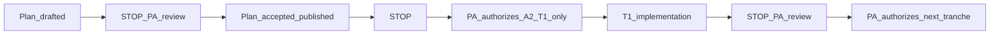
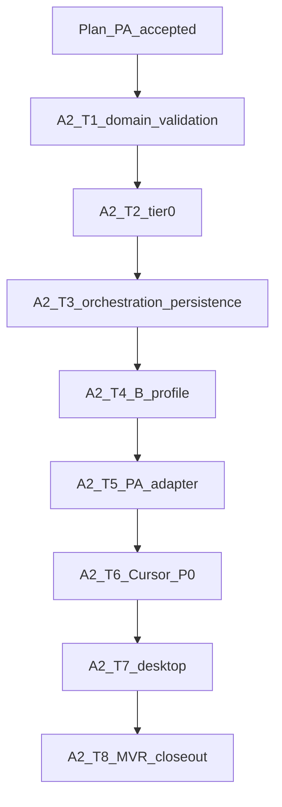

[Home](../../README.md) › [Project Index](../../PROJECT_INDEX.md) › [Handover](README.md) › ProjectConcord A2 Implementation Plan

# ProjectConcord A2 — Implementation Plan

**Tranche:** PAR track **A2** — Manual P0 Governed Interaction Relay

> **A2 implementation:** **IN PROGRESS** — **A2-T1** and **A2-T2 closed / PA accepted**; see [T1](ProjectConcord-A2-T1-Implementation-Notes.md) and [T2](ProjectConcord-A2-T2-Implementation-Notes.md) implementation notes.
>
> **A2-T3 through A2-T8: NOT AUTHORIZED** (separate PA authorization per tranche).

**Mode:** **CLOSED** — A2 **implementation plan** accepted and published (2026-09-29); **A2 `src/` implementation in progress** (T1–T2 published; A2 not complete)

**Planning baseline (pre-plan tranche):** `1098a336569b2f0d7e0af347788b25d8d7e877b3` — *Accept reconciled SPEC-006 governed relay specification.*

**Publication:** Recorded in [§26 A2 plan closeout](#26-a2-plan-closeout-2026-09-29) (governed docs commit on `main`).

**Published A1 baseline:** `fba5be51559364d8385edca18b12399f2b5e9b28` — [A1 plan §20](ProjectConcord-A1-Implementation-Plan.md#20-a1-overall-closeout-2026-09-28)

**Architecture basis:** [SPEC-006](../Specifications/features/SPEC-006-par-project-root-and-governed-workflow-relay.md) (**Accepted** 2026-09-29), [ADR-0016](../Architecture/ADRs/ADR-0016-Core-Domain-Extension-and-Working-Environment-Boundary.md), [ADR-0015](../Architecture/ADRs/ADR-0015-Project-Identity-PAR-and-Per-User-Operational-State.md), [ADR-0013](../Architecture/ADRs/ADR-0013-Governed-Development-Workflow-and-Workspace-Model.md), [ADR-0017](../Architecture/ADRs/ADR-0017-Project-Work-Record-Core-Boundary.md), [PAR Workflow Architecture Plan](ProjectConcord-PAR-Workflow-Architecture-Plan.md) (A0), [AWI-0006](../Architecture/Watch_Items/AWI-0006-PAR-Cursor-Bridge-Transport.md)

**Governance inputs:** A2 Readiness and Implementation-Scope Analysis — **ACCEPTED WITH PA QUALIFICATIONS**; **A2-T1 PA accepted** (2026-09-29); **A2-T2 PA accepted** (2026-09-30); **A2-T3–T8 NOT AUTHORIZED**; **A3 / A4 NOT AUTHORIZED**; **PCON-0002** remains **Proposed** / deferred.

**Published A2-T1 baseline:** [§27](#27-a2-t1-closeout-2026-09-29). **Published A2-T2 baseline:** [§28](#28-a2-t2-closeout-2026-09-30).

---

## Project Architect disposition

| Item | Status |
|------|--------|
| A2 readiness analysis | **ACCEPTED WITH PA QUALIFICATIONS** |
| A2 plan documentation tranche | **CLOSED** (draft + binding amendments incorporated 2026-09-29) |
| **This A2 plan** | **CLOSED / PROJECT ARCHITECT ACCEPTED / PUBLISHED** (2026-09-29) — binding amendments 1–3 preserved in §8, §18, §22 (T8) |
| A2 implementation (`src/`) | **IN PROGRESS** — T1–T2 published; A2 not complete |
| **A2-T1** | **CLOSED / PROJECT ARCHITECT ACCEPTED** (2026-09-29) — [implementation notes](ProjectConcord-A2-T1-Implementation-Notes.md) |
| **A2-T2** | **CLOSED / PROJECT ARCHITECT ACCEPTED** (2026-09-30) — [implementation notes](ProjectConcord-A2-T2-Implementation-Notes.md) |
| A2-T3 … A2-T8 | **NOT AUTHORIZED** — separate PA authorization per tranche |
| A3 / A4 | **NOT AUTHORIZED** |
| STOP-2 (MVR execution instances) | **Binding** — out of relay scope |

*Historical:* Plan was **DRAFT / PA REVIEW REQUIRED** until PA acceptance 2026-09-29; amendments accepted subject to disposable MVR workspace, T8 remediation STOP, and serialization authority rules.

---

## 1. Reconciled A2 definition

**A2** delivers the first **manual P0** slice of the decomposed **Governed Interaction Relay**:

| Layer | A2 minimum |
|-------|------------|
| **A — Core** | Transport-neutral package identity/correlation; assembly; structural validation; **INCOMPLETE**; provenance chain; relay-boundary **STOP** behavior; **Tier-0** relay-safe context; provider-neutral session abstractions |
| **B — Software Development** | Minimum **PA Review Package** profile; boundary validation (handover vs **DevelopmentWorkAuthorization** conflation; planning vs implementation); STOP/work/tranche context; thin result/evidence correlation |
| **D — Working Environment** | Optional policy reference hook only — **no** facet persistence |
| **E — Adapters** | `IProjectArchitectProvider`; manual Project Architect adapter; manual P0 **Cursor** handover boundary |
| **F — EDF** | Canonical references/correlation in packages only — ProjectConcord does **not** close gates or replace Git authority |

Historical **PAR** terminology remains umbrella/provenance only ([SPEC-006 §1](../Specifications/features/SPEC-006-par-project-root-and-governed-workflow-relay.md)).

---

## 2. Explicit non-goals (binding)

A2 **MUST NOT** implement:

- A3 governed-workflow MVP breadth; full **DevelopmentWorkAuthorization** lifecycle/store/UI; **HumanInitiatedWorkItem** workflow; full **ArchitecturalReviewSubmission** lifecycle
- Baseline drift enforcement (PC-AIGOV-009), scope conformance engine (PC-AIGOV-010), inter-project Software Development (PC-AIGOV-021–028)
- A4 automated **CursorBridge** transport; Cursor extension; MCP; ACP; OpenAI API automation
- M2+ **Edf.Engine** EDF discovery, parsing, profile resolution, conformance validation
- **ProjectWorkRecord** implementation; **AuthorityGrant** schema; **PCON-0002** Actor/Role; Working Environment persistence/facets
- Multi-project application shell UX architecture (PC-AIGOV-022)
- MVR **execution** during implementation planning (STOP-2)
- Creating `.projectconcord/` on Project Root open/select (PC-PAR-006)

---

## 3. Authorization model

**Acceptance or publication of this plan does NOT authorize A2 implementation or any tranche automatically.**



Each **A2-Tn** section below states **NOT AUTHORIZED** until PA records separate authorization. **Do not** combine tranches without explicit PA disposition.

---

## 4. A1 reuse (no redesign)

| A1 component | Location | A2 use |
|--------------|----------|------|
| `ProjectConcordProjectId` | `Edf.Domain/Projects/` | Partition key for all relay persistence |
| `ProjectRoot`, `ProjectRootResolver` | Domain / `Edf.Engine/Projects/` | Session locator; path validation only |
| `ProjectWorkspaceService` | `Edf.Application/Projects/` | Requires open Project Root before relay mutations |
| `ICurrentProjectSession` / `ILocalProjectRuntime` | Application / `Edf.ProjectServices.Local` | Active project context |
| SQLite store + `Migration001Initial` | `Edf.ProjectServices/Persistence/` | Extend via **forward-only** `Migration002*` |
| `SchemaMigrationRunner` | ProjectServices | A2 schema evolution (PC-PAR-010) |
| `IProjectRegistry`, recent roots | Application + store | Unchanged; relay scoped to `CurrentProjectId` |
| `ApplicationCompositionRoot` | `Edf.Application/Composition/` | Register relay ports/services |
| Desktop MVVM | `Edf.Desktop/ViewModels/` | Add relay workflow VM / commands |

**Layering (unchanged):** Domain has no SQLite; Application has no `Microsoft.Data.Sqlite`; infrastructure in **ProjectServices**.

---

## 5. Tier-0 placement decision (PA qualification)

### 5.1 Options considered

| Location | Assessment |
|----------|------------|
| **`Edf.Engine`** | **Rejected for Tier-0.** [System Architecture Overview](../Architecture/System_Architecture_Overview.md) positions `Edf.Engine` as M2+ discovery, classification, and profile resolution. Today it only hosts `ProjectRootResolver` (path normalization). Adding Git HEAD probes and governance path checks here would **blur** the boundary between shallow relay awareness and the future EDF engine. |
| **`Edf.ProjectServices`** | **Selected** for **infrastructure** implementation: read-only Git subprocess (or equivalent) and filesystem existence checks under the active `ProjectRoot` locator. |
| **`Edf.Application`** | **Selected** for **port** `ITier0RelaySnapshotProvider` (or equivalent) and orchestration; consumes ProjectServices adapter. |

### 5.2 Rationale

Tier-0 is **shallow, relay-safe, read-only repository awareness** ([SPEC-006 §12](../Specifications/features/SPEC-006-par-project-root-and-governed-workflow-relay.md), [ADR-0015 §5](../Architecture/ADRs/ADR-0015-Project-Identity-PAR-and-Per-User-Operational-State.md)). It is **not** M2 EDF parsing. Placing it in **ProjectServices** keeps Git/filesystem IO at the infrastructure seam already used for SQLite, without implying EDF engine ownership.

**Suggested layout (when implemented):**

- `Edf.Application/Relay/ITier0RelaySnapshotProvider.cs`
- `Edf.ProjectServices/Relay/Tier0RelaySnapshotProvider.cs` (implementation)

### 5.3 Tier-0 minimum snapshot content

| Field | Source | Notes |
|-------|--------|-------|
| `gitHeadCommit` | `git rev-parse HEAD` in Project Root (if `.git` exists) | Optional empty if not a git repo |
| `knownPathsPresent` | `File.Exists` for fixed list | e.g. `ARCHITECTURE_DECISIONS.md`, `PROJECT_INDEX.md`, `docs/Program/Gate_Reviews/` |
| `narrowMetadata` | Regex on known files only | e.g. `**Status:**` line from `Implementation_Roadmap.md` — **no** general Markdown AST |

**Forbidden:** EDF parser, conformance scripts, profile resolution, arbitrary repo walk.

**Boundary tests:** Provider returns DTO only; never writes repo; never creates `.projectconcord/`; fails gracefully when Git unavailable.

---

## 6. Core relay model (neutral envelope)

Generic Core types **MUST NOT** embed DWA or other B-layer semantics. Use an opaque **profile payload** seam.

### 6.1 Domain concepts (planned)

| Concept | Owner | Purpose |
|---------|-------|---------|
| `GovernedPackageId` | A | Stable id per package instance |
| `GovernedCorrelationId` | A | Links export → import → downstream handover in one user cycle |
| `GovernedPackageKind` | A | e.g. `PaReviewExport`, `PaHandoverImport`, `CursorHandoverExport`, `EngineeringResultImport` |
| `RelaySchemaVersion` | A | Internal DTO schema version (distinct from rendering version) |
| `RelayRenderVersion` | A/E | Serialization v1 marker in rendered text |
| `RelayValidationState` | A | `Valid`, `Incomplete`, `RejectedMalformed` |
| `RelayStopState` | A | Active STOP flags at relay boundary (metadata only) |
| `AgentSessionIntent` | A | User-selected NEW/CONTINUE for PA and Engineering agent |
| `AgentSessionAdvisory` | A | Optional recommendation; **cannot** override user intent |
| `Tier0RelaySnapshot` | A | Immutable snapshot captured at assembly time |
| `SoftwareDevelopmentProfilePayload` | B | Opaque to Core validator except structural keys agreed at boundary |

### 6.2 Envelope fields (minimum)

- Package id, correlation id, kind, schema version, render version
- `ProjectConcordProjectId`, created/updated timestamps (UTC)
- Session continuity (PA + Engineering agent intents + advisories)
- Validation state + diagnostic list (for INCOMPLETE)
- Tier-0 snapshot (embedded or reference id — see §7)
- STOP state reference
- **Profile payload** (B-layer JSON blob) — not interpreted by Core except via B-boundary validator port

---

## 7. Persistence model (PA qualification — derived, not prescriptive names)

Readiness analysis table names (`governed_packages`, etc.) were **illustrative only**. This plan defines the **smallest** persistence needed.

### 7.1 Persisted concepts

| Concept | Semantic owner | Why persist | Project ID partition | Retention / reconstruction |
|---------|----------------|-------------|----------------------|----------------------------|
| **Relay continuity state** | A | User NEW/CONTINUE choices must survive restart ([PC-PAR-021](../Specifications/features/SPEC-006-par-project-root-and-governed-workflow-relay.md)) | `project_id` FK | Latest intent per agent role; used on next package assembly |
| **Relay package record** | A | Package/correlation identity; audit trail of export/import | `project_id` | Stores envelope metadata + validation outcome; enables history view |
| **Relay provenance event** | A | Chain: observed → advisory → decision → action → produce/consume | `project_id` | Append-only events; link to `package_id` / `correlation_id` |
| **Tier-0 snapshot blob** | A | Reconstruct what context was sent without re-reading Git at import time | Embedded in package row **or** `snapshot_id` | Immutable once package finalized |
| **B profile payload** | B | PA Review content, disposition blocks, tranche context | Stored inside package record as JSON | Not a separate DWA entity table in A2 |
| **Optional content hash** | A | Detect paste tampering / duplicate import | On package record | Optional in A2; not required for identity |

### 7.2 Planned schema approach (Migration002 — names tentative until T3)

Single logical store extension in per-user SQLite ([ADR-0015 §2](../Architecture/ADRs/ADR-0015-Project-Identity-PAR-and-Per-User-Operational-State.md)):

1. **`relay_continuity`** — `(project_id, agent_role, user_intent, advisory_json, updated_utc)` PK `(project_id, agent_role)`
2. **`relay_package`** — envelope columns + `tier0_json`, `profile_payload_json`, `validation_json`, `rendered_body_hash` (optional)
3. **`relay_provenance_event`** — `(event_id, project_id, package_id, correlation_id, event_type, payload_json, recorded_utc)`

**Not in A2:** DWA rows, submission rows, HIW inbox, PWR rows, Working Environment config tables.

### 7.3 Migration impact

- Forward-only `Migration002RelayOperational` via existing runner
- No change to A1 `managed_projects` semantics
- Document backup/restore implications in Developer Handbook (same DB file)

---

## 8. Serialization v1 (A2 implementation choice)

**Not** a permanent cross-provider protocol. Internal DTO + **delimited Markdown** for human paste.

### 8.1 Internal representation

- JSON serialization of neutral `GovernedPackageEnvelope` + typed `SoftwareDevelopmentProfilePayload` (B)
- Stored in SQLite on export; used for validation on import after parse

### 8.2 Rendered representation (manual adapter)

The rendered P0 package contains **two coupled layers**:

1. **Structured machine block** — authoritative relay state for import.
2. **Human-readable Markdown projections** — including duplicated governance-critical fields for inspection; **must agree** with the machine block (see §8.3).

**Preferred A2 v1 encoding (binding):** plain JSON in the fenced machine block (not base64url). Human readability and diagnosability are required for P0 manual workflow. If implementation discovers a **concrete** technical blocker to plain JSON round-trip through copy/paste, **STOP** and report to Project Architect — do not silently change format.

Example shape (outer document is Markdown; inner fence uses language tag `projectconcord-relay-v1`):

- Line 1: `ProjectConcord-Relay-Render: 1`
- Fenced block `projectconcord-relay-v1` containing a single JSON object (the authoritative envelope)
- Below: `## Governance-Critical` with key-value lines that **project** the same values as the JSON (e.g. `Cursor-Mode: PLAN`)

| Element | Rule |
|---------|------|
| Version marker | First line: `ProjectConcord-Relay-Render: 1` |
| Machine block | Fenced block ` ```projectconcord-relay-v1 ` … ` ``` ` containing **valid JSON** of the full envelope (pretty-print or minified — either is acceptable if JSON-valid) |
| Human sections | Markdown headings for PA readability below machine block |
| Governance-critical fields | **Projected duplicates** in `## Governance-Critical` and related B sections (`## Authorization-Disposition`, `## STOP`, `## Work-Context`): `Cursor-Mode`, `Cursor-Chat`, `ChatGPT-Chat`, `Cursor-Mode-Transition` (when applicable), plus disposition/STOP/tranche fields |

The human-readable projection is **not** a second independent source of governance truth.

### 8.3 Parsing behavior and authority (binding — PA Amendment 3)

On import:

1. Require render version marker; unknown major version → `RelayValidationState.RejectedMalformed`
2. Parse machine block → DTO; JSON/structure failure → **`RejectedMalformed`**
3. Parse/inspect duplicated governance-critical rendered fields from human sections
4. **Compare** machine block values to projected duplicates; require **semantic agreement**
5. If machine representation and duplicated human-readable governance-critical representation **disagree** → **`RejectedMalformed`**
   - MUST NOT classify as **Incomplete** only
   - MUST NOT prefer human prose
   - MUST NOT silently prefer one conflicting value
   - MUST NOT infer intended value from surrounding prose
6. If structurally parseable and projections agree, run PC-PAR-020 + B boundary validation:
   - required governance information **absent or insufficient** → **`Incomplete`** with diagnostics
   - all requirements satisfied → **`Valid`**
7. **Never** infer missing governance fields from prose outside structured sections ([PC-PAR-015](../Specifications/features/SPEC-006-par-project-root-and-governed-workflow-relay.md))
8. Surrounding prose that **contradicts** structured/projected governance state → **no inference / no override**; treat as **`RejectedMalformed`** when contradiction is between authoritative machine block and required projections, or reject import per adapter rules without elevating prose

**Validation-state distinction (binding):**

| State | Meaning |
|-------|---------|
| **`Valid`** | Structurally parseable; machine and projected governance-critical fields agree; required governance metadata present and boundary rules pass |
| **`Incomplete`** | Structurally parseable package; machine and projections agree where present; **required** governance information absent or insufficient — not unsafe to interpret structurally |
| **`RejectedMalformed`** | Package cannot be safely interpreted — including invalid JSON, missing machine block, conflicting machine vs projected governance fields (mode, sessions, STOP, authorization disposition, tranche/work context, etc.) |

### 8.4 Forward version handling

- Minor render version bumps may be accepted by adapter if schema compatible
- Unknown major → user-visible error; suggest upgrade ProjectConcord

---

## 9. PC-PAR-020 field model

| Field | Internal (A) | Rendered (E) | Required when |
|-------|--------------|--------------|---------------|
| Cursor mode | `EngineeringAgentMode` enum | `Cursor-Mode` | Always |
| Cursor chat continuity | `AgentSessionIntent` | `Cursor-Chat` | Always |
| PA chat continuity | `AgentSessionIntent` | `ChatGPT-Chat` | Manual adapter always |
| Mode transition | prior + new mode | `Cursor-Mode-Transition` | When mode changes |
| Authorization disposition | B structured block | `## Authorization-Disposition` | When directing implementation work |
| STOP | `RelayStopState` | `## STOP` | When STOP active or acknowledged |
| Tranche/work context | B structured block | `## Work-Context` | When package directs tranche work |
| EDF correlation | optional pointers | `## EDF-Correlation` | Optional traceability to **F** artifacts |

Missing governance-critical (with agreeing machine + projections) → **`Incomplete`**. Machine/human governance mismatch → **`RejectedMalformed`** (§8.3). Advisories must not override user NEW/CONTINUE.

---

## 10. Software Development profile boundary (B)

**A2 implements boundary/profile validation**, not the full operational model in [SPEC-004](../Specifications/features/SPEC-004-ai-assisted-development-governance-workflow.md) / [ADR-0013](../Architecture/ADRs/ADR-0013-Governed-Development-Workflow-and-Workspace-Model.md).

| In scope A2 | Deferred A3+ |
|-------------|----------------|
| PA Review Package snapshot: Tier-0 + session + explicit disposition blocks | DWA CRUD UI and persisted DWA entities |
| Validate handover content does not **merge** handover with DWA semantics (PC-AIGOV-003) | Full submission review lifecycle |
| Validate planning text does not imply implementation authorization (PC-AIGOV-004) | Baseline drift, scope conformance |
| Thin evidence/result import with correlation id | ArchitecturalReviewSubmission store |
| STOP metadata at boundary (PC-AIGOV-007) | Automated agent STOP execution in IDE |

**Port:** `ISoftwareDevelopmentRelayProfileValidator` (Application, B-layer) invoked by Core orchestrator.

---

## 11. P0 manual workflow

| Step | Actor | Action | Persisted |
|------|-------|--------|-----------|
| 1 | Human | Select Project Root (A1) | — |
| 2 | Core (A) | Capture Tier-0 snapshot | Tier-0 in next package |
| 3 | Human | Set PA + Cursor session NEW/CONTINUE | `relay_continuity` |
| 4 | Core (A) | Assemble PA Review Package | — |
| 5 | B | Attach profile payload | profile JSON |
| 6 | Core (A) | Pre-export validation | — |
| 7 | E | Render Markdown + machine block | — |
| 8 | Human | Copy/export → paste to Project Architect | — |
| 9 | Human | Paste PA response into ProjectConcord | — |
| 10 | E | Parse import | — |
| 11 | A+B | Validate → Valid / Incomplete / RejectedMalformed | `relay_package`, events |
| 12a | Core | If **Incomplete** or **RejectedMalformed** → diagnostics; **no** validated Cursor handover | event |
| 12b | Core | If **Valid** → record consume event | event |
| 13 | E | Render Cursor handover from validated import | package export |
| 14 | Human | Copy → paste into Cursor | — |
| 15 | Human | (Optional) paste thin result/evidence | import package |
| 16 | Core | Correlate provenance | events |

**STOP points:** Active STOP in package → block validated implementation handover until disposition recorded; relay does not execute STOP-2 MVR.

---

## 12. Provider adapter (E)

### 12.1 `IProjectArchitectProvider` (Application port)

| Operation | Responsibility |
|-----------|----------------|
| `RenderPaReviewPackage` | Envelope → Markdown string |
| `TryParsePaHandoverImport` | string → envelope or malformed |
| `DeclareCapabilities` | P0 static flags: manual paste, render v1, fields PC-PAR-020 |

**No** provider thread IDs in Core ([PC-PAR-021](../Specifications/features/SPEC-006-par-project-root-and-governed-workflow-relay.md)). **No** dynamic negotiation beyond static capability declaration (PC-PAR-019 minimal).

### 12.2 `ProjectArchitectManualAdapter`

- ChatGPT-oriented field labels per SPEC-006 §9
- Reminder text in outbound PA package: next Cursor handover must include `Cursor-Mode` (+ transition when applicable)

---

## 13. Cursor P0 boundary (E + A)

### 13.1 `ICursorRelayBridge` (name tentative)

| Method | A2 behavior |
|--------|-------------|
| `RenderValidatedHandover` | Produce Cursor-directed Markdown from **Valid** PA import only |
| `TryParseEngineeringResult` | Optional thin import for evidence/result paste |

**MUST NOT:** invoke Cursor, control IDE, use extension/MCP/ACP, manufacture authorization.

### 13.2 PC-PAR-014 (PA qualification)

| Scope | Behavior |
|-------|----------|
| **A2-active** | **Incomplete** (or malformed) input **cannot** produce a **validated/ready** Cursor handover export |
| **Future automation (A4)** | Same validation state **blocks automated forwarding** on `ICursorRelayBridge` automation hook — seam defined in T6, **not implemented** in A2 |

**No fake automation** to satisfy PC-PAR-014. Unit tests assert handover generation gated on `RelayValidationState.Valid` only.

---

## 14. Provenance (PC-PAR-021)

| Stage | Persisted | Transient |
|-------|-----------|-----------|
| Observed context | Event + Tier-0 snapshot on package | — |
| Advisory | Optional in continuity + event | — |
| User decision | Session intent in `relay_continuity` + event | — |
| Requested next action | Event | UI form state |
| Produce/consume package | `relay_package` + event | — |
| Full chat transcripts | **Not** canonical (PC-AIGOV-002) | Discard / do not require |

**Correlation:** `GovernedCorrelationId` ties PA export, PA import, Cursor export, optional result import. Provider conversation IDs optional in E-layer only.

---

## 15. Trust boundary

Imported PA/Cursor text is **untrusted**:

- Malformed → `RejectedMalformed` — never `Valid`
- Machine vs projected governance-critical mismatch → `RejectedMalformed` — never `Incomplete` or `Valid`
- Missing governance-critical metadata (agreed structure) → `Incomplete` — never infer from prose
- Prose cannot override structured/projected governance fields
- Imported packages cannot close EDF gates or mutate Git-canonical acceptance ([SPEC-006 §9 F](../Specifications/features/SPEC-006-par-project-root-and-governed-workflow-relay.md))
- STOP metadata cannot silently authorize implementation
- Operational DB remains non-authoritative for EDF (PC-PAR-011)

---

## 16. UI / UX minimum (Desktop)

Extend [MainWindowViewModel](src/Edf.Desktop/ViewModels/MainWindowViewModel.cs) or sibling **`RelayWorkflowViewModel`** (T7):

| Feature | Required |
|---------|----------|
| Generate PA Review Package | Yes |
| Copy / export to clipboard | Yes |
| Paste import PA response | Yes |
| Show validation result + INCOMPLETE / RejectedMalformed diagnostics | Yes |
| PA session NEW/CONTINUE | Yes |
| Cursor session NEW/CONTINUE | Yes |
| Generate Cursor handover (only when Valid) | Yes |
| Copy Cursor handover | Yes |
| Minimal provenance/history list (last N packages/events) | Yes |
| Thin evidence/result import | Yes (if included in T6 scope) |

No A3 workflow management UI (DWA editor, submission inbox).

---

## 17. Test strategy

### 17.1 Requirement-to-test matrix

| Requirement | Test type | Project |
|-------------|-----------|---------|
| PC-PAR-012 assembly | Unit + integration | `Edf.Application.Tests` |
| PC-PAR-013 import / INCOMPLETE | Unit (fixtures) | Application + adapter tests |
| PC-PAR-014 A2-active gating | Unit | Application — no handover unless `Valid` |
| PC-PAR-015 no inference | Unit | Application |
| PC-PAR-016–018 provider boundary | Unit | Application |
| PC-PAR-019 capabilities | Unit | Static declaration smoke |
| PC-PAR-020 fields | Round-trip unit | Application + manual adapter |
| PC-PAR-021 provenance | Integration | `Edf.ProjectServices.Tests` (SQLite) |
| PC-PAR-022 P0 export | Unit | Cursor manual bridge |
| Tier-0 boundaries | Unit | ProjectServices — temp git repo |
| PC-AIGOV-003/004/007 | Unit | B profile validator |
| Persistence / restart | Integration | ProjectServices |
| Serialization v1 | Round-trip | Application |
| Malformed import | Unit | Adapter |
| STOP | Unit | Relay orchestrator |

### 17.2 Serialization v1 tests (binding — PA Amendment 3)

| Scenario | Expected `RelayValidationState` |
|----------|--------------------------------|
| Valid machine block + matching human governance projection | Proceed to boundary checks → **`Valid`** or **`Incomplete`** as appropriate |
| Structurally valid package; required governance-critical field missing (machine + projections agree on absence) | **`Incomplete`** |
| Malformed machine JSON / missing machine block | **`RejectedMalformed`** |
| Machine/human governance-field mismatch (e.g. `Cursor-Mode`, sessions, STOP, authorization disposition, work context) | **`RejectedMalformed`** |
| STOP mismatch between machine block and projected `## STOP` representation | **`RejectedMalformed`** |
| Authorization-disposition mismatch between machine payload and `## Authorization-Disposition` | **`RejectedMalformed`** |
| Surrounding prose contradicts structured/projected governance | **No inference / no override**; treat as **`RejectedMalformed`** when contradiction involves authoritative vs required projections |

### 17.3 New test projects

- Prefer **`Edf.Application.Tests`** for orchestration and validators (in-memory ports)
- **`Edf.ProjectServices.Tests`** for SQLite migrations and Tier-0 provider (temp paths)
- Optional **`Edf.Relay.Tests`** only if file count warrants — default **no** new project in A2

---

## 18. MVR plan (not executed in planning tranche)

**Prerequisites:** A2-T1–T7 implemented; automated tests green; Desktop build on macOS; **disposable verification Project Root prepared** (see Environment).

| Item | Plan |
|------|------|
| Record id | **MVR-0002** (proposed id — assign at T8 draft creation) |
| Location | `docs/Verification/Records/MVR-0002-a2-p0-manual-governed-relay-workflow.md` |
| Template | Follow [MVR-0001](../Verification/Records/MVR-0001-a1c-desktop-project-root-recent-workflow.md) structure |
| **Environment (binding — PA Amendment 1)** | A2 MVR execution **SHALL** use a **disposable test Project Root** consistent with EDF [DVW-0001](https://github.com/edbecnel/Engineering-Documentation-Framework/blob/main/docs/Specifications/DVW-0001-Disposable-Verification-Workspaces.md). Acceptable examples: `~/tmp/ProjectConcord-A2-MVR/Root-A` or another clearly disposable temporary path. A **disposable clone or fixture** of ProjectConcord **may** be used when realistic EDF content is required, provided it is **explicitly disposable** and is **not** relied upon for real work. **MUST NOT** use as MVR subject: the **active ProjectConcord development repository** (the repo used for ProjectConcord product/engineering work); any **production EDF repository**; any repository the operator relies upon for real work. Verification must not risk mutation of canonical working repositories. |
| Steps | Open **disposable** Project Root in Desktop → set sessions → generate PA package → copy → simulate PA response paste (fixture file) → **Incomplete** case → **Valid** case → **at least one visible malformed/divergent import** (machine/human governance mismatch → RejectedMalformed diagnostics) if feasible without undue MVR expansion → generate Cursor handover (Valid path only) → optional result paste → verify provenance list |
| Evidence | Screenshots or pasted diagnostics; correlation ids recorded; record disposable root path used |
| PASS/FAIL | Operator attestation; FAIL blocks A2 closeout (see T8 — FAIL does not authorize `src/` remediation) |
| STOP-2 | No execution MVR instance creation through relay |

**T8** creates **Draft** MVR record if required by [SPEC-005](../Specifications/features/SPEC-005-manual-verification-record-consumption.md) workflow; **do not** complete MVR during planning or amendment tranches.

---

## 19. Governance records

| Artifact | Required for A2 closeout? | Source |
|----------|----------------------------|--------|
| Canonical A2 Implementation Plan (this doc) | Yes — PA accept/publish | PA disposition |
| Per-tranche PA authorization | Yes | [Implementation Roadmap](../Development/Implementation_Roadmap.md) PAR track pattern |
| Automated test evidence | Yes | CI / local `dotnet test` |
| Scoped P0 MVR | Yes | SPEC-005 consumption pattern; A1c precedent |
| PA closeout / publication commit | Yes | A1 §20 precedent |
| Dedicated new EGR | **No** | PAR track uses PA tranche authorization |
| AAR per tranche | **Not automatic** | [ADR-0012](../Architecture/ADRs/ADR-0012-Adopt-EDF-Architectural-Audit-Records.md) |

---

## 20. A2 closeout criteria

1. All **authorized** A2-Tn tranches accepted by PA
2. `dotnet test -c Release` passes for affected projects
3. **MVR-0002** (or successor) **Complete / PASSED**
4. PC-PAR-012–022 mapping reconciled to implementation in plan amendment or §21 table update
5. [GAP-043](../Development/EDF_Gap_Register.md) updated — relay portion **partially addressed**; do not fully close until PA agrees
6. [Implementation Roadmap](../Development/Implementation_Roadmap.md) current status updated — A2 published, not A3/A4
7. No accidental A3/A4 automation in `src/`
8. Final PA **accept/publish** disposition on plan closeout section (like A1 §20)

**Do not** pre-close GAP-043 in this planning tranche.

---

## 21. PC-PAR mapping (A2 plan target)

| ID | A2 tranche primary owner |
|----|--------------------------|
| PC-PAR-001–011 | Satisfied by **A1** (verify only) |
| PC-PAR-012 | T3, T4 |
| PC-PAR-013 | T1, T5, T7 |
| PC-PAR-014 | T1, T6 (A2-active gating) |
| PC-PAR-015 | T1, T4 |
| PC-PAR-016–018 | T5 |
| PC-PAR-019 | T5 (static capabilities) |
| PC-PAR-020 | T1, T5, T6 |
| PC-PAR-021 | T3, T7 |
| PC-PAR-022 | T6 (P0 manual) |

### SPEC-004 references (boundary only)

| ID | A2 use |
|----|--------|
| PC-AIGOV-002 | No chat-as-canonical; packages derived |
| PC-AIGOV-003 | B validator — handover vs DWA |
| PC-AIGOV-004 | B validator — planning vs implementation |
| PC-AIGOV-007 | STOP at relay boundary |
| PC-AIGOV-008 | Thin correlation on result import |
| PC-AIGOV-015 | Tier-0 + operational provenance |

---

## 22. Implementation tranches

### A2-T1 — Core domain + validation

| | |
|---|---|
| **Authorization** | **CLOSED / PROJECT ARCHITECT ACCEPTED** (2026-09-29) |
| **Objective** | Neutral envelope types, PC-PAR-020 validation rules, INCOMPLETE/malformed distinction |
| **Scope** | `Edf.Domain/Relay/*`; validation in `Edf.Application/Relay/` |
| **Non-goals** | SQLite, UI, adapters, Tier-0 provider |
| **Prerequisites** | A1 published; **this plan accepted** |
| **Owners** | A (+ B validator interfaces) |
| **PC-PAR** | 013, 014 (rules), 015, 020 |
| **PC-AIGOV** | 003, 004 (interface stubs) |
| **Persistence** | None |
| **Tests** | 11 focused relay unit tests; 47 total Release tests green |
| **Acceptance** | PA accepted — [T1 implementation notes](ProjectConcord-A2-T1-Implementation-Notes.md) |
| **Evidence** | Baseline `916ba9509d7beded5e57ee94d83be32b073d64bc`; publication commit in [§27](#27-a2-t1-closeout-2026-09-29) |
| **STOP** | T1 closed — **await PA authorization for A2-T2 only** |

---

### A2-T2 — Tier-0 snapshot capability

| | |
|---|---|
| **Authorization** | **CLOSED / PROJECT ARCHITECT ACCEPTED** (2026-09-30) |
| **Objective** | Read-only Tier-0 provider per §5 |
| **Scope** | `ITier0RelaySnapshotProvider`; `Tier0RelaySnapshotProvider` in ProjectServices |
| **Non-goals** | EDF engine features; `.projectconcord/` |
| **Prerequisites** | T1 types for snapshot DTO |
| **Owners** | A |
| **PC-PAR** | 012 (Tier-0 inputs) |
| **Persistence** | None (snapshot embedded at package time in T3) |
| **Tests** | 12 focused Tier-0 tests; 59 total Release tests green |
| **Acceptance** | PA accepted — [T2 implementation notes](ProjectConcord-A2-T2-Implementation-Notes.md) |
| **Evidence** | Baseline `05cdd85568408d6e71052d09b397c994b9004f18`; publication commit in [§28](#28-a2-t2-closeout-2026-09-30) |
| **STOP** | T2 closed — **await PA authorization for A2-T3 only** |

---

### A2-T3 — Relay orchestration + persistence

| | |
|---|---|
| **Authorization** | **NOT AUTHORIZED** |
| **Objective** | Orchestrator, provenance events, Migration002 |
| **Scope** | `IGovernedInteractionRelayService`; SQLite tables §7; ports |
| **Non-goals** | B profile content, adapters, UI |
| **Prerequisites** | T1, T2 |
| **Owners** | A |
| **PC-PAR** | 012, 021 |
| **Persistence** | §7 tables |
| **Tests** | ProjectServices integration; restart continuity |
| **Acceptance** | Export records package + events without render |
| **STOP** | End T3 → PA review |

---

### A2-T4 — Software Development profile + boundary rules

| | |
|---|---|
| **Authorization** | **NOT AUTHORIZED** |
| **Objective** | PA Review profile payload + `ISoftwareDevelopmentRelayProfileValidator` |
| **Scope** | `Edf.Application/Relay/SoftwareDevelopment/*` |
| **Non-goals** | DWA entity store, submissions |
| **Prerequisites** | T3 |
| **Owners** | B (validator), A (orchestration hook) |
| **PC-PAR** | 012 B-clause, 015 |
| **PC-AIGOV** | 003, 004, 007 |
| **Persistence** | `profile_payload_json` only |
| **Tests** | Fixture packages — conflation failures |
| **Acceptance** | B boundary tests green |
| **STOP** | End T4 → PA review |

---

### A2-T5 — Project Architect provider + serialization v1

| | |
|---|---|
| **Authorization** | **NOT AUTHORIZED** |
| **Objective** | `IProjectArchitectProvider`, manual adapter, render/parse v1 |
| **Scope** | Application port + implementation (ProjectServices or Application subfolder per layering review at T5) |
| **Non-goals** | OpenAI API |
| **Prerequisites** | T1, T3, T4 |
| **Owners** | E |
| **PC-PAR** | 016–019, 020 render |
| **Tests** | Round-trip fixtures; unknown version |
| **Acceptance** | Parse/render tests; no provider IDs required |
| **STOP** | End T5 → PA review |

---

### A2-T6 — Cursor P0 manual bridge

| | |
|---|---|
| **Authorization** | **NOT AUTHORIZED** |
| **Objective** | `ICursorRelayBridge` manual implementation; PC-PAR-014 seam |
| **Scope** | Render validated handover; optional result parse |
| **Non-goals** | Automation hooks implementation; A4 |
| **Prerequisites** | T1, T3, T5 |
| **Owners** | E, A |
| **PC-PAR** | 014, 022 |
| **Tests** | Gating tests; mode routing intent |
| **Acceptance** | Cannot export handover when Incomplete |
| **STOP** | End T6 → PA review |

---

### A2-T7 — Desktop P0 workflow

| | |
|---|---|
| **Authorization** | **NOT AUTHORIZED** |
| **Objective** | UI §16 wired to relay service |
| **Scope** | `Edf.Desktop` ViewModels/AXAML |
| **Non-goals** | A3 workflow UI |
| **Prerequisites** | T5, T6 |
| **Owners** | A (host), E (clipboard) |
| **PC-PAR** | 021 visibility |
| **Tests** | Manual prep for MVR; optional lightweight VM tests |
| **Acceptance** | Build succeeds; smoke checklist |
| **STOP** | End T7 → PA review before MVR tranche |

---

### A2-T8 — Verification, MVR, documentation closeout

| | |
|---|---|
| **Authorization** | **NOT AUTHORIZED** — T8 authorization **does not** authorize `src/` changes |
| **Objective** | **Verification** + **MVR** + **documentation** + **closeout** (§20) |
| **Scope** | Execute scoped P0 MVR (§18 disposable root); complete MVR record; update GAP/roadmap/plan closeout sections in `docs/` only |
| **Non-goals** | Feature implementation; **`src/` remediation without separate PA authorization** |
| **Remediation rule (binding — PA Amendment 2)** | If automated verification or MVR identifies a defect requiring **source-code modification**, **T8 SHALL STOP**. Source remediation requires **separate Project Architect authorization** for an explicit remediation tranche or plan amendment. After remediation is accepted, T8 verification may be **resumed/re-authorized** as appropriate. An MVR failure is **evidence requiring disposition**, not implicit authority to edit implementation. |
| **Prerequisites** | T1–T7 |
| **Owners** | F (MVR), Program |
| **Tests** | Full automated suite (must already pass before MVR); completed MVR operator attestation |
| **Acceptance** | PA A2 closeout disposition |
| **STOP** | On MVR FAIL or defect requiring `src/` change → STOP pending PA remediation authorization; on success → **A2 complete** — separate authorization for **A3** |

---

## 23. Staged delivery diagram



---

## 24. Deferred architecture preserved

| Topic | Disposition |
|-------|-------------|
| PCON-0002 | Provisional transport labels only |
| AuthorityGrant | Conceptual; no schema |
| PWR | No A2 dependency |
| Working Environment | Reference hook only |
| A3 / M7a | Full governed workflow |
| A4 / AWI-0006 | Automated Cursor transport |
| M2 EDF engine | Discovery/parsing/conformance |

---

## 25. STOP (post-publication)

**STOP** after A2 plan publication on `main` (2026-09-29).

- Plan acceptance **does not** authorize A2 implementation or any A2-Tn tranche
- **Await explicit PA authorization for A2-T1 only** before any `src/` relay work
- **No** MVR-0002 execution until authorized implementation tranches complete

---

## 26. A2 plan closeout (2026-09-29)

**PA disposition:** **A2 IMPLEMENTATION PLAN CLOSED / PROJECT ARCHITECT ACCEPTED / PUBLISHED** (2026-09-29). Plan documents manual P0 Governed Interaction Relay scope and tranche decomposition; **A2 implementation remains NOT AUTHORIZED**.

| Stage | Notes |
|-------|--------|
| Readiness analysis | Accepted with PA qualifications |
| Plan draft + amendments 1–3 | Incorporated (MVR disposable root §18; T8 remediation §22; serialization authority §8) |
| Plan acceptance / publication | **2026-09-29** — governed documentation commit on `main` (see git log for SHA) |

**Next governance decision (historical):** Whether to authorize **A2-T1** only — **resolved** 2026-09-29 (T1 accepted; see [§27](#27-a2-t1-closeout-2026-09-29)).

---

## 27. A2-T1 closeout (2026-09-29)

**PA disposition:** **A2-T1 CLOSED / PROJECT ARCHITECT ACCEPTED** (2026-09-29). Core governed relay domain types and validation published on `main`; **A2-T2 NOT AUTHORIZED**.

| Item | Notes |
|------|--------|
| Implementation baseline | `916ba9509d7beded5e57ee94d83be32b073d64bc` |
| Evidence | [A2-T1 implementation notes](ProjectConcord-A2-T1-Implementation-Notes.md) |
| Focused tests | 11 passed (`FullyQualifiedName~Relay`) |
| Release tests | 47 passed (Application 30, ProjectServices 13, Desktop 4) |
| Publication commit | Recorded on `main` at T1 closeout commit SHA (see git log) |

**Next governance decision (historical):** Whether to authorize **A2-T2 only** — **resolved** 2026-09-30 (T2 accepted; see [§28](#28-a2-t2-closeout-2026-09-30)).

---

## 28. A2-T2 closeout (2026-09-30)

**PA disposition:** **A2-T2 CLOSED / PROJECT ARCHITECT ACCEPTED** (2026-09-30). Read-only Tier-0 snapshot capability published on `main`; **A2-T3 NOT AUTHORIZED**.

| Item | Notes |
|------|--------|
| Implementation baseline | `05cdd85568408d6e71052d09b397c994b9004f18` |
| Evidence | [A2-T2 implementation notes](ProjectConcord-A2-T2-Implementation-Notes.md) |
| Focused tests | 12 passed (`FullyQualifiedName~Tier0Relay`) |
| Release tests | 59 passed (Application 30, ProjectServices 25, Desktop 4) |
| Publication commit | Recorded on `main` at T2 closeout commit SHA (see git log) |

**Next governance decision:** Whether to authorize **A2-T3 only** (relay orchestration + persistence). **Do not** infer T4–T8 authorization.

---

## Parent

- [Handover](README.md)

## Related Documents

- [A1 Implementation Plan](ProjectConcord-A1-Implementation-Plan.md)
- [SPEC-006](../Specifications/features/SPEC-006-par-project-root-and-governed-workflow-relay.md)
- [Implementation Roadmap](../Development/Implementation_Roadmap.md)
- [EDF Gap Register](../Development/EDF_Gap_Register.md) (GAP-043, GAP-044)
- [MVR-0001](../Verification/Records/MVR-0001-a1c-desktop-project-root-recent-workflow.md)
