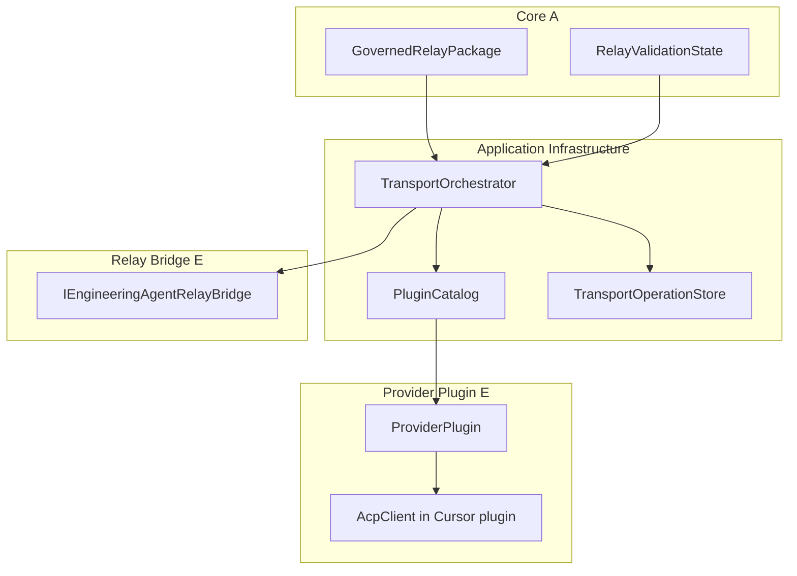

[Home](../../README.md) › [Project Index](../../PROJECT_INDEX.md) › [Handover](README.md) › ProjectConcord A4 Implementation Plan

# ProjectConcord A4 — Implementation Plan

**Tranche:** PAR track **A4** — Engineering Agent automated transport (P1+)

> **PLAN ACCEPTANCE DOES NOT AUTHORIZE A4 IMPLEMENTATION.**
>
> **EACH A4 IMPLEMENTATION TRANCHE REQUIRES EXPLICIT PROJECT ARCHITECT AUTHORIZATION.**

> **A4 implementation plan:** **CLOSED / PROJECT ARCHITECT ACCEPTED / PUBLISHED** (2026-10-01). **A4-T0–T6 CLOSED / PA ACCEPTED / PUBLISHED** (2026-10-01). **A4-T7 AUTHORIZED — verification in progress** (2026-10-01); **not PA accepted/published**. Overall A4 **in progress / not closed**.

**Mode:** **CLOSED / PROJECT ARCHITECT ACCEPTED / PUBLISHED** (2026-10-01)

**Planning baseline:** `a7b6552ab2f05a0c8d1d4a063e0846d5d27888bf` — *Accept ADR-0023 Engineering Agent plugin hosting architecture.*

**Publication:** Recorded in [§26 A4 plan closeout](#26-a4-plan-closeout-2026-10-01) (governed docs commit on `main`).

**Architecture basis:** [ADR-0021](../Architecture/ADRs/ADR-0021-Engineering-Agent-Provider-Plugin-Contract.md), [ADR-0022](../Architecture/ADRs/ADR-0022-Engineering-Agent-Automated-Transport-Architecture.md), [ADR-0023](../Architecture/ADRs/ADR-0023-Engineering-Agent-Plugin-Hosting-and-Registration-Architecture.md), [ADR-0019](../Architecture/ADRs/ADR-0019-Local-First-Operational-Persistence-Service-Boundary-Synchronization-and-Concurrency.md), [ADR-0020](../Architecture/ADRs/ADR-0020-Operator-Projections-Product-Shell-and-Workspace-Navigation.md), [SPEC-006](../Specifications/features/SPEC-006-par-project-root-and-governed-workflow-relay.md), published [A2 P0 governed relay](ProjectConcord-A2-Implementation-Plan.md) implementation on `main`, [PAR Workflow Architecture Plan](ProjectConcord-PAR-Workflow-Architecture-Plan.md)

**Governance inputs:** **PA accepted** A4 implementation plan (2026-10-01); **A4-T0–T6 PA accepted / published** (2026-10-01); **A4-T7 authorized** (2026-10-01) — [T7 evidence](ProjectConcord-A4-T7-Verification-Evidence.md); **MVR-0003 human execution In progress** (Groups C/D Pass; Group A/B blocked on external Cursor ACP non-fast); **A3 NOT AUTHORIZED**. Overall A4 **not closed**.

---

## Project Architect disposition

| Item | Status |
|------|--------|
| A4 architecture (ADR-0021/0022/0023) | **Accepted** (2026-10-01) |
| **This A4 implementation plan** | **CLOSED / PROJECT ARCHITECT ACCEPTED / PUBLISHED** (2026-10-01) |
| A4 implementation (`src/`, tests) | **T0–T6 published** on `main` — [T6 notes](ProjectConcord-A4-T6-Implementation-Notes.md); overall A4 **not closed** |
| **A4-T0** | **CLOSED / PROJECT ARCHITECT ACCEPTED / PUBLISHED** (2026-10-01) — [T0 notes](ProjectConcord-A4-T0-Implementation-Notes.md); [§27](#27-a4-t0-closeout-2026-10-01) |
| **A4-T1** | **CLOSED / PROJECT ARCHITECT ACCEPTED / PUBLISHED** (2026-10-01) — [T1 notes](ProjectConcord-A4-T1-Implementation-Notes.md); [§28](#28-a4-t1-closeout-2026-10-01) |
| **A4-T2** | **CLOSED / PROJECT ARCHITECT ACCEPTED / PUBLISHED** (2026-10-01) — [T2 notes](ProjectConcord-A4-T2-Implementation-Notes.md); [§29](#29-a4-t2-closeout-2026-10-01) |
| **A4-T3** | **CLOSED / PROJECT ARCHITECT ACCEPTED / PUBLISHED** (2026-10-01) — [T3 notes](ProjectConcord-A4-T3-Implementation-Notes.md); [§30](#30-a4-t3-closeout-2026-10-01) |
| **A4-T4** | **CLOSED / PROJECT ARCHITECT ACCEPTED / PUBLISHED** (2026-10-01) — [T4 notes](ProjectConcord-A4-T4-Implementation-Notes.md); [§31](#31-a4-t4-closeout-2026-10-01) |
| **A4-T5** | **CLOSED / PROJECT ARCHITECT ACCEPTED / PUBLISHED** (2026-10-01) — [T5 notes](ProjectConcord-A4-T5-Implementation-Notes.md); [§32](#32-a4-t5-closeout-2026-10-01) |
| **A4-T6** | **CLOSED / PROJECT ARCHITECT ACCEPTED / PUBLISHED** (2026-10-01) — [T6 notes](ProjectConcord-A4-T6-Implementation-Notes.md); [§33](#33-a4-t6-closeout-2026-10-01) |
| **A4-T7** | **AUTHORIZED — IN PROGRESS** (2026-10-01) — blocker-independent human MVR **complete**; machine Release validation **PASS**; [MVR-0003](../Verification/Records/MVR-0003-a4-engineering-agent-automated-transport.md) **In progress** (external blocker on Group A/B); **PA accept/publish pending** |
| A3 | **NOT AUTHORIZED** |

No implementation tranche inherits authority from plan publication.

---

## 1. Reconciled A4 definition

**A4** delivers the first **automated** slice of the **Governed Interaction Relay** Engineering Agent path while preserving permanent **P0 manual** fallback:

| Layer | A4 minimum |
|-------|------------|
| **A — Core** | Unchanged governed package semantics, validation, eligibility, STOP, provenance; **transport failure MUST NOT mutate package governance validity** |
| **B — Software Development** | Unchanged relay profile boundary; consume existing validators |
| **Application / infrastructure** | Static plugin catalog/hosting; transport-operation operational persistence; provider-neutral orchestration; recovery/idempotency; minimal ADR-0020 projections |
| **E — Provider plugin contract** | Automated forward, result candidate retrieval, cancel, health, routing-intent mapping (provider-specific mechanics inside plugin) |
| **E — Relay bridge** | `IEngineeringAgentRelayBridge` — **render / parse only** (no ACP/CLI in bridge) |
| **E — Cursor reference plugin** | First-party provider: ACP client → Cursor CLI `agent acp` (non-normative reference path per ADR-0022 §16) |

**Transport lifecycle ≠ governance lifecycle.** Transport-operation state is **operational** ([ADR-0022](../Architecture/ADRs/ADR-0022-Engineering-Agent-Automated-Transport-Architecture.md) §5); relay package validation dispositions remain owned by Core relay rules.

---

## 2. Explicit non-goals (binding)

A4 **MUST NOT** implement:

- **A3** governed-workflow MVP breadth; full **DevelopmentWorkAuthorization** lifecycle/store/UI
- **M2+** EDF engine discovery, parsing, profile resolution
- **MCP** as primary governed relay transport ([ADR-0022](../Architecture/ADRs/ADR-0022-Engineering-Agent-Automated-Transport-Architecture.md) §12)
- Generalized **loadable-plugin** framework; filesystem/assembly **discovery**; marketplace; signing PKI; auto-update; enterprise plugin distribution
- Dynamic third-party plugin installation without explicit registration and enablement
- **AWI-0009** structured authoring form runtime
- Architecture redesign of ADR-0021/0022/0023 boundaries
- Multi-process local operational-store concurrency resolution ([GAP-048](../Development/EDF_Gap_Register.md#gap-048--same-project-id--multiple-local-application-processes), [GAP-052](../Development/EDF_Gap_Register.md#gap-052--multi-process-local-operational-store-concurrency-strategy-and-validation))
- MVR **execution** or verification **record** creation during this planning/documentation tranche (STOP-2 pattern from [A2 plan §18](ProjectConcord-A2-Implementation-Plan.md#18-mvr-plan-not-executed-in-planning-tranche))

---

## 3. Authorization model

**Acceptance or publication of this plan does NOT authorize A4 implementation or any tranche automatically.**

```mermaid
flowchart LR
  Draft[A4_plan_drafted] --> Stop0[STOP_PA_plan_acceptance]
  Stop0 --> Accepted[Plan_accepted_published]
  Accepted --> Stop1[STOP]
  Stop1 --> AuthT0[PA_authorizes_A4_T0_only]
  AuthT0 --> ImplT0[T0_implementation]
  ImplT0 --> Stop2[STOP_PA_review]
  Stop2 --> AuthTn[PA_authorizes_next_tranche]
  AuthTn --> ImplTn[Tn_implementation]
  ImplTn --> Stop3[STOP_PA_review]
  Stop3 --> AuthT7[PA_authorizes_A4_T7]
  AuthT7 --> Verify[T7_verification_closeout]
  Verify --> Stop4[STOP_PA_A4_closeout]
```



**Authorization chain (binding):**

1. **A4 plan DRAFT** → **PA plan acceptance** (publication commit) — **does not** authorize implementation  
2. **PA authorizes A4-T0** → T0 execution → **PA review**  
3. **PA authorizes A4-T1** → … → **PA authorizes A4-T7**  
4. **T7** verification + closeout evidence → **PA A4 overall closeout** — **does not** authorize A3 or follow-on without separate PA decision  

No tranche inherits authorization because a prior tranche completed.

---

## 4. A2 reuse (no redesign)

| A2 component | Location | A4 use |
|--------------|----------|--------|
| `IGovernedRelayP0WorkflowService` / `GovernedRelayP0WorkflowService` | `Edf.Application/Relay/` | Eligibility, produce/consume, import pipeline — **reuse**; add separate automated transport service |
| `IGovernedInteractionRelayService` / `GovernedInteractionRelayService` | `Edf.Application/Relay/` | `RecordProducedPackage`, `RecordConsumedPackage`, session continuity |
| `IEngineeringAgentRelayBridge` / `EngineeringAgentManualRelayBridge` | `Edf.Application/Relay/EngineeringAgent/` | `TryRenderValidatedHandover`, `TryParseEngineeringResult` — **unchanged role** |
| `RelayValidatedHandoverEligibility` | `Edf.Application/Relay/` | Same automated forward gate as P0 manual |
| `IRelayOperationalStore` + Migration002 | Application port / `Edf.ProjectServices` | Relay packages, continuity, provenance — **extend** with separate transport-operation store |
| `EngineeringAgentMode` | `Edf.Domain/Relay/` | Neutral routing intent (`Plan`, `Agent`, `Debug`) |
| `RelayWorkflowViewModel` | `Edf.Desktop/ViewModels/` | Extend for automated actions + status; preserve manual Copy/Import |
| `ApplicationCompositionRoot` | `Edf.Application/Composition/` | Register catalog, host, orchestrator, **production** providers only |
| A2 automated tests | `tests/Edf.Application.Tests/Relay/` etc. | Regression baseline — must stay green |

**Layering (unchanged):** Domain has no SQLite; Application has no `Microsoft.Data.Sqlite`; persistence implementations in **ProjectServices** behind Application ports.

---

## 5. Transport-operation model placement (PA refinement)

[ADR-0022](../Architecture/ADRs/ADR-0022-Engineering-Agent-Automated-Transport-Architecture.md) defines transport-operation semantics as **operational** state distinct from governed package lifecycle.

| Placement | Rule |
|-----------|------|
| **Transport-operation lifecycle, state machine, attempt policy, recovery semantics** | **`Edf.Application`** — operational semantics (e.g. `Edf.Application/Relay/EngineeringAgent/Transport/`) |
| **Neutral identity value** | A small **`TransportOperationId`** (or equivalent) **MAY** live in **`Edf.Domain`** **only if** T0 repository inspection confirms an existing pattern for opaque operational ids **without** importing transport lifecycle into Core governance — **T0 finalizes placement** |
| **Forbidden** | Treating transport state as package validation state; persisting transport lifecycle rules in Core validators |

**Invariants (binding):**

- `TransportOperationId` ≠ `GovernedPackageId` / `PackageId` ([ADR-0022](../Architecture/ADRs/ADR-0022-Engineering-Agent-Automated-Transport-Architecture.md) §4)  
- Provider session handles are **noncanonical** hints ([ADR-0022](../Architecture/ADRs/ADR-0022-Engineering-Agent-Automated-Transport-Architecture.md) §11)  
- Forward/transport failure **MUST NOT** change relay `RelayValidationState` except optional non-authoritative operator facets ([ADR-0021](../Architecture/ADRs/ADR-0021-Engineering-Agent-Provider-Plugin-Contract.md) §6)

---

## 6. Provider Plugin Identity (PA refinement)

[ADR-0023](../Architecture/ADRs/ADR-0023-Engineering-Agent-Plugin-Hosting-and-Registration-Architecture.md) §5 defines a stable conceptual **Provider Plugin Identity** for registration, configuration, selection, and attribution.

This plan **does not** prescribe string slug, GUID, concrete class name, or serialization format. **Authorized implementation tranches** choose a stable representation consistent with ADR-0023.

**Must remain distinct from:** ProjectConcord Project ID, `PackageId`, `GovernedCorrelationId`, `TransportOperationId`, provider session handles.

*Non-normative example only:* a catalog entry might be labeled in tests as `"cursor-acp-reference"` — **not** architectural prescription.

---

## 7. Fake provider (PA refinement)

`FakeEngineeringAgentProviderPlugin` (or equivalent) is **test infrastructure only**.

| Context | Rule |
|---------|------|
| **Production** `ApplicationCompositionRoot` / catalog | Register **only** real provider implementations that are actually available and enabled (initially: **Cursor reference plugin** when authorized, or **no** automated provider → manual P0 only) |
| **Tests** | Use fake plugin via **test-specific** composition, test doubles, or test catalog builders — **never** ship fake provider in production catalog |

---

## 8. Normal vs recovered result intake (PA refinement)

| Path | Behavior |
|------|----------|
| **Normal automated flow** | Result candidate → `TryParseEngineeringResult` → structural/profile validation → **`RecordConsumedPackage`** per existing governed import flow — **no** universal operator confirmation step added for every successful in-session candidate unless an **existing** governing requirement already applies |
| **Recovery flow** | After restart/recovery, when persisted transport state is **result candidate received** ([ADR-0022](../Architecture/ADRs/ADR-0022-Engineering-Agent-Automated-Transport-Architecture.md) §10, AF-1): **operator confirmation required by default** before invoking governed import — transport recovery **MUST NOT** imply governance acceptance |

Tests **MUST** cover both paths explicitly (T4 integration; T7 regression).

---

## 9. Provider-neutral orchestration sequence

Binding sequence ([ADR-0022](../Architecture/ADRs/ADR-0022-Engineering-Agent-Automated-Transport-Architecture.md) §2–3):

1. Governed package at relay boundary; **PC-PAR-014** / eligibility — same blocks as P0 automated forward  
2. `IEngineeringAgentRelayBridge.TryRenderValidatedHandover`  
3. `IGovernedInteractionRelayService.RecordProducedPackage`  
4. Create/update **transport operation** (operational ledger)  
5. Selected plugin: forward rendered handover + neutral routing metadata + session continuity from `RelaySessionContinuity`  
6. Result candidate → `TryParseEngineeringResult` → validation → consume (normal vs recovery confirmation per §8)  
7. On transport failure: update transport state + operator projections; **package validation unchanged**

New presentation-free service (planned for **A4-T3**): **`IEngineeringAgentAutomatedTransportService`** alongside **`IGovernedRelayP0WorkflowService`** — not introduced in T0.

---

## 10. Plugin hosting / catalog ([ADR-0023](../Architecture/ADRs/ADR-0023-Engineering-Agent-Plugin-Hosting-and-Registration-Architecture.md))

| Concern | A4 approach |
|---------|-------------|
| Registration | **Explicit / static** catalog populated at composition (built-in Cursor plugin when enabled) |
| Enablement / trust | Explicit enablement before invocation; no mandatory trust-tier taxonomy |
| Selection | Configuration + availability + **three compatibility dimensions** (host/plugin contract, relay/render protocol, capability/routing adequacy) |
| Discovery | **Not required** — no filesystem scanning or reflection discovery |
| Process model | No generalized out-of-process plugin host; subprocess/stdio **inside** Cursor plugin only |

---

## 11. Persistence and GAP-048 / GAP-052

| Item | Disposition |
|------|-------------|
| **A4 MVP assumption** | **Single desktop application process** per user installation writing **`user-state.db`** — same coordination model as published A2 relay persistence |
| **GAP-048 / GAP-052** | **Implementation coordination only** — **not** architecture blockers for A4 MVP; **do not** implement multi-process locking, shared-write policy, or sync reconciliation in A4 |
| **Migration** | Additive **`Migration003*`** (name T2) — transport-operation tables only; **preserve** Migration002 relay tables and existing Project state |
| **Port** | `ITransportOperationStore` (Application); SQLite adapter in ProjectServices (align with [GAP-051](../Development/EDF_Gap_Register.md#gap-051--application-layer-persistence--service-port-isolation) direction — new store behind port) |
| **STOP rule** | If implementation **requires** cross-process transport recovery semantics → **STOP to PA** before proceeding |

**Semantic fields (minimum per ADR-0022 §4–5):** `TransportOperationId`, `SourcePackageId`, `GovernedCorrelationId`, attempt, selected Provider Plugin Identity, lifecycle state, optional provider session hint, optional result import linkage, audit timestamps.

---

## 12. Routing intent ([ADR-0022](../Architecture/ADRs/ADR-0022-Engineering-Agent-Automated-Transport-Architecture.md) §9)

Neutral ProjectConcord routing intent: **PLAN**, **AGENT**, **DEBUG** (mapped from `EngineeringAgentMode` where applicable).

| Intent | Cursor reference (non-normative) |
|--------|----------------------------------|
| PLAN | Cursor **Plan** |
| AGENT | Cursor **Agent** |
| DEBUG | **No** adequate Cursor mapping — **automated DEBUG unsupported**; **MUST NOT** silently map to Agent or Ask |

When automated DEBUG unsupported: report neutral failure + preserve **P0 manual** where eligible.

---

## 13. Cursor provider and ACP (reference realization)

Non-normative reference stack ([ADR-0022](../Architecture/ADRs/ADR-0022-Engineering-Agent-Automated-Transport-Architecture.md) §16):

```text
Application/infrastructure orchestration
  → Cursor provider plugin (Edf.Application …/Providers/Cursor/ or authorized layout)
  → ACP adapter/client (stdio JSON-RPC)
  → Cursor CLI `agent acp`
```

Headless `agent -p` **MAY** be used only as **provider-internal** secondary/fallback/diagnostic behavior — **not** provider-neutral architecture.

**ACP scope (inside plugin):** process lifecycle; initialize; authentication; session/new|load; session/prompt; session/update; permission requests; session/cancel; result candidate extraction; session hint persistence; timeout/crash handling.

---

## 14. Permission policy ([ADR-0022](../Architecture/ADRs/ADR-0022-Engineering-Agent-Automated-Transport-Architecture.md) §15)

- **Deny-by-default** for scope/authority expansion  
- **`allow-once`** **MAY** apply to an explicitly eligible operation under orchestration/operator policy  
- **`allow-always`** **MUST NOT** be the ProjectConcord architectural default  

Provider permission is **operational only** — not DWA, STOP override, package acceptance, or governance authority.

---

## 15. Operator projections ([ADR-0020](../Architecture/ADRs/ADR-0020-Operator-Projections-Product-Shell-and-Workspace-Navigation.md))

**Current code (A4-T5 published):** minimum Application-level Attention / Next Action contributors and DTOs under `Edf.Application/Operator/`; relay-workflow Desktop surfacing in `RelayWorkflowViewModel`.

| Failure / condition | Projection |
|---------------------|------------|
| Plugin unavailable, incompatible, auth failure, init failure | **Attention** |
| Forward failure, result retrieval failure, ambiguous transport state | **Attention** |
| P0 manual relay still eligible | **Recommended** Next Action → manual governed relay — **not Required** |

No parallel provider workflow lifecycle.

---

## 16. P0 fallback (permanent)

Reuse existing P0 path unchanged in semantics: eligibility, renderer, parser, validator, provenance ([ADR-0022](../Architecture/ADRs/ADR-0022-Engineering-Agent-Automated-Transport-Architecture.md) §13).

**Regression (T5, T7):** Automated transport and plugin hosting **disabled or failed** → manual Prepare/Copy/Import still work; package validity unaffected by transport failures.

---

## 17. Environment and validation tooling

| Requirement | Value |
|---------------|--------|
| .NET SDK | **10.0.401** per [global.json](../../global.json) — **do not** downgrade project targets for older local SDKs |
| Automated tests | `dotnet test -c Release` on authorized tranches |
| Cursor CLI | Required only for **Cursor provider integration tests** (optional trait) and **human MVR** steps in T7 — not for provider-independent unit/integration tests |
| Disposable MVR workspace | EDF [DVW-0001](https://github.com/edbecnel/Engineering-Documentation-Framework/blob/main/docs/Specifications/DVW-0001-Disposable-Verification-Workspaces.md) — same binding pattern as [A2 plan §18](ProjectConcord-A2-Implementation-Plan.md#18-mvr-plan-not-executed-in-planning-tranche) |

---

## 18. MVR plan (not executed in this documentation tranche)

**Governance basis (canonical — not analogy alone):**

| Source | Requirement |
|--------|-------------|
| EDF [MVR-0001](https://github.com/edbecnel/Engineering-Documentation-Framework/blob/192fe5c1c6254c51e257d24aefc09e127ce72464/docs/Specifications/MVR-0001-Manual-Verification-Records.md) | Human manual verification obligations are declared in **MVR instance** procedures with MVTs |
| [SPEC-005](../Specifications/features/SPEC-005-manual-verification-record-consumption.md) | Planning/implementation artifacts declare **what** must be verified; MVR Markdown under `docs/Verification/Records/` is canonical for human execution |
| [A2 closeout pattern](ProjectConcord-A2-Implementation-Plan.md#20-a2-closeout-criteria) | Operator-visible PAR Desktop workflow used **scoped MVR** ([MVR-0002](../Verification/Records/MVR-0002-a2-p0-manual-governed-relay-workflow.md)) before PA A2 overall closeout |

**A4 determination:**

- A4 introduces **operator-visible** automated transport behavior (T5–T6 Desktop integration) in addition to existing P0 manual paths. **Planned verification artifact:** **`MVR-0003`** (next sequential id after [MVR-0002](../Verification/Records/MVR-0002-a2-p0-manual-governed-relay-workflow.md) per [Verification Records README](../Verification/Records/README.md)).  
- **PA qualification (2026-10-01):** The exact **MVR-0003** required scope, procedures, and completion criteria **SHALL be reconfirmed when A4-T7 is authorized** — before drafting or executing the MVR instance.  
- **Plan publication and A4 overall closeout (§20):** Target closeout expects scoped MVR **Complete** with applicable MVT **Pass** when T7 completes — consistent with [SPEC-005](../Specifications/features/SPEC-005-manual-verification-record-consumption.md) and the A2 PAR precedent.  
- **This tranche:** **Does not** create MVR-0003; **does not** mark any MVR **Complete**.  
- **STOP-2:** No MVR execution during plan publication or unauthorized tranches.

**T7 scope (when authorized):** Draft/execute MVR-0003 covering automated forward (where enabled), recovery confirmation path, P0 fallback smoke, and regression checks — using disposable Project Root; **MUST NOT** use ProjectConcord development repo as MVR subject.

---

## 19. AAR and gate records

| Artifact | A4 applicability | Basis |
|----------|------------------|--------|
| **AAR** | **No AAR-0002 is required merely because A4 is being implemented** (PA determination 2026-10-01) | [ADR-0012](../Architecture/ADRs/ADR-0012-Adopt-EDF-Architectural-Audit-Records.md); [AAR-0001](../Architecture/Audits/AAR-0001-m1-solution-skeleton-conformance.md) already satisfied **EGR-G1** prerequisite |
| **Optional scoped AAR** | **PA MAY later require** a scoped conformance audit if implementation materially crosses, challenges, or requires verification against an accepted architecture boundary | **Not** characterized as permanently inapplicable |
| **Plan publication** | **Does not** create AAR-0002 | — |
| **Per-tranche AAR** | **Not automatic** (A2 precedent) | — |
| **EGR-G0 / EGR-G1** | **Not replayed** for A4 | PA tranche authorization → T7 verification → PA A4 closeout → publication |
| **PA tranche acceptance** | **Required** after each authorized Tn | §3 |
| **PA A4 overall closeout** | **Required** after authorized T7 | §20 |

---

## 20. A4 closeout criteria (target — when T7 authorized)

1. All **authorized** A4-T0 … A4-T7 tranches accepted by PA  
2. `dotnet test -c Release` passes for affected projects on **SDK 10.0.401**  
3. Scoped **MVR-0003** **Human execution status Complete** with applicable MVT **Pass** — scope/procedures **reconfirmed at A4-T7 authorization** (§18); instance created only in authorized T7  
4. P0 manual relay regression satisfied (automated suite + MVR where applicable)  
5. [Implementation Roadmap](../Development/Implementation_Roadmap.md) updated — A4 **implementation complete** only after PA closeout — **not** implied by plan acceptance  
6. No accidental A3 scope in `src/`  
7. Final PA **accept/publish** disposition on this plan closeout section  

**Do not** create MVR or verification evidence files during this documentation tranche.

---

## 21. ADR implementation mapping summary

| ADR | Implementation focus |
|-----|----------------------|
| **ADR-0021** | `IEngineeringAgentProviderPlugin` + neutral failure/capability types; plugin owns auth/config/secrets scope; no governance mutation |
| **ADR-0022** | Orchestrator + transport operation ledger + idempotency/recovery/cancel; routing intent rules; P0 parity; permission policy |
| **ADR-0023** | Static catalog, host, enablement, selection, compatibility checks — **no** generalized loader |

---

## 22. Test strategy

| Layer | Focus |
|-------|--------|
| **Unit** | Catalog/compatibility/selection; transport state transitions; routing adequacy; duplicate forward/result; substitution; permission policy adapter |
| **Integration** | Orchestrator + **fake provider (tests only)** + in-memory/SQLite store; normal vs recovery import paths |
| **Provider** | ACP framing fixtures; optional `[Trait("RequiresCursor")]` tests |
| **Regression** | Full A2 relay tests; P0 without production fake plugin; package validity after transport failures |

**Projects:** Prefer **`Edf.Application.Tests`**, **`Edf.ProjectServices.Tests`**, **`Edf.Desktop.Tests`** — no new test project unless T0 evidence warrants.

---

## 23. Future per-tranche documentation (paths only — do not create now)

| Tranche | Expected notes / evidence (create only when authorized) |
|---------|-----------------------------------------------------------|
| T0–T6 | `ProjectConcord-A4-Tn-Implementation-Notes.md` |
| T7 | `ProjectConcord-A4-T7-Verification-Evidence.md`; `docs/Verification/Records/MVR-0003-*.md` when governance requires |

---

## 24. Implementation tranches

### A4-T0 — Contracts and neutral implementation skeleton

| | |
|---|---|
| **Authorization** | **CLOSED / PROJECT ARCHITECT ACCEPTED / PUBLISHED** (2026-10-01) |
| **Objective** | Provider plugin contract interfaces; hosting ports; transport operation **Application** model; orchestrator/service interfaces **deferred to T3** |
| **Architecture basis** | ADR-0021 §2; ADR-0022 §4–5; ADR-0023 §2–7 |
| **Likely areas** | `Edf.Application/Relay/EngineeringAgent/Plugins/`; `…/Transport/` |
| **Dependencies** | Published A2 on `main`; A4 plan PA accepted |
| **Boundaries** | No SQLite; no Cursor/ACP; no Desktop automation UI |
| **Tests** | `EngineeringAgentA4T0ContractTests`; test-only `FakeEngineeringAgentProviderPlugin` |
| **Acceptance** | PA accepted — [T0 implementation notes](ProjectConcord-A4-T0-Implementation-Notes.md) |
| **Validation** | SDK **10.0.401**; `dotnet build -c Release` **PASS**; T0 **13** tests **PASS**; regression **156** **PASS** |
| **Evidence** | Publication commit on `main` — [§27](#27-a4-t0-closeout-2026-10-01) |
| **STOP** | T0 closed — **await PA authorization for A4-T1 only** |

---

### A4-T1 — Static catalog, hosting, selection

| | |
|---|---|
| **Authorization** | **CLOSED / PA ACCEPTED / PUBLISHED** (2026-10-01) |
| **Objective** | Plugin catalog + host; static registration of **production** providers only; enablement; compatibility triad |
| **Architecture basis** | ADR-0023 §3–9 |
| **Implementation** | `EngineeringAgentPluginCatalog`, `EngineeringAgentPluginHost`, preferences store, compatibility evaluator, selection service; `EngineeringAgentPluginHostingFactory` |
| **T0 contract refinement** | Bounded addition of provider `InitializeAsync` / `ShutdownAsync` (ADR-0023 lifecycle); **A4-T0 remains CLOSED** |
| **Dependencies** | T0 |
| **Boundaries** | **No** `FakeEngineeringAgentProviderPlugin` in production catalog; **no** transport orchestration or Migration003 |
| **Tests** | `EngineeringAgentA4T1HostingTests` (**17** tests); T0 contract tests updated for lifecycle surface |
| **Validation** | SDK **10.0.401**; `dotnet build -c Release` **PASS**; regression **174** **PASS** |
| **STOP** | T1 closed — **await PA authorization for A4-T2 only** |

---

### A4-T2 — Transport-operation persistence

| | |
|---|---|
| **Authorization** | **CLOSED / PA ACCEPTED / PUBLISHED** (2026-10-01) |
| **Objective** | `Migration003TransportOperations` + SQLite `ITransportOperationStore` |
| **Implementation** | `transport_operation` table; `PersistedTransportOperation`; store partial + adapters; composition wiring |
| **Dependencies** | T1 |
| **Boundaries** | **No** orchestration, Forward, polling, import, recovery |
| **Tests** | `TransportOperationPersistenceTests` (**12**); schema test reconciliation for v**3** |
| **Validation** | SDK **10.0.401**; **187** tests **PASS** |
| **STOP** | T2 closed — **await PA authorization for A4-T3 only** |

---

### A4-T3 — Orchestration with test fake provider

| | |
|---|---|
| **Authorization** | **CLOSED / PA ACCEPTED / PUBLISHED** (2026-10-01) |
| **Objective** | `EngineeringAgentTransportOrchestrator` + `IEngineeringAgentAutomatedTransportService`; governance-first preflight → init → readiness → durable Forward |
| **Architecture basis** | ADR-0022 §2–3; §8 normal flow |
| **Implementation** | `Edf.Application/Relay/EngineeringAgent/Transport/`; preflight + runtime readiness (bounded T1 refinement); **`DesktopApplicationServices.AutomatedTransport`** |
| **Dependencies** | T2; P0 workflow; T1 host/selection |
| **Boundaries** | No recovery/retry/Cursor/UI; fake plugin tests only |
| **Tests** | `EngineeringAgentA4T3OrchestrationTests` (**25**); ordering + orchestration evidence |
| **Validation** | SDK **10.0.401**; **211** tests **PASS** |
| **STOP** | T3 closed — T4 **published** (2026-10-01); **await PA authorization for A4-T5 only** |

---

### A4-T4 — Recovery, idempotency, cancellation

| | |
|---|---|
| **Authorization** | **CLOSED / PA ACCEPTED / PUBLISHED** (2026-10-01) |
| **Objective** | Restart recovery + idempotency; AF-1 confirmation before recovered import |
| **Implementation** | **`IEngineeringAgentTransportRecoveryService`**; **`GetRecoverableOperations`**; explicit resume/reconcile/confirm; bounded T3 **`ForwardInProgress`** pre-dispatch boundary |
| **Dependencies** | T3 |
| **Boundaries** | No UI/startup auto-exec/background worker; no provider substitution |
| **Tests** | **`EngineeringAgentA4T4RecoveryTests`** (**14**); T3 orchestration durability tests updated |
| **Validation** | SDK **10.0.401**; **225** tests **PASS** |
| **STOP** | T4 closed — **A4-T5 NOT AUTHORIZED** |

---

### A4-T5 — Operator projections, P0 regression, minimal Desktop

| | |
|---|---|
| **Authorization** | **CLOSED / PROJECT ARCHITECT ACCEPTED / PUBLISHED** (2026-10-01) |
| **Objective** | Attention contributors; Recommended P0 action; minimal Desktop automated commands + status; **P0 regression** |
| **Architecture basis** | ADR-0020; ADR-0022 §14 |
| **Implementation** | `Edf.Application/Operator/`; `RelayWorkflowOperatorProjectionService`; `RelayWorkflowViewModel` + `MainWindow.axaml` |
| **Dependencies** | T4 |
| **Tests** | `EngineeringAgentA4T5OperatorProjectionTests` (**6**); `RelayWorkflowViewModelAutomatedTransportTests` (**2**); A2 relay regression green |
| **Validation** | SDK **10.0.401**; **233** tests **PASS** |
| **Acceptance** | Manual path works with automation disabled; transport failure does not mutate package validation |
| **Evidence** | Publication commit on `main` — [§32](#32-a4-t5-closeout-2026-10-01) |
| **STOP** | T5 closed — **await PA authorization for A4-T6 only** |

---

### A4-T6 — Cursor provider and ACP adapter

| | |
|---|---|
| **Authorization** | **CLOSED / PROJECT ARCHITECT ACCEPTED / PUBLISHED** (2026-10-01) |
| **Objective** | `CursorEngineeringAgentProviderPlugin` + `CursorAcpClient`; PLAN/AGENT mapping; DEBUG unsupported |
| **Architecture basis** | ADR-0022 §9, §16; ADR-0021 plugin boundary |
| **Implementation** | `Edf.Application/Relay/EngineeringAgent/Providers/Cursor/` — ACP subprocess `agent acp`; static catalog registration |
| **Dependencies** | T5 |
| **Tests** | `EngineeringAgentA4T6CursorProviderTests` (**15**); `CursorAcpNdjsonCodecTests` (**2**); optional `[Trait("RequiresCursor")]` |
| **Validation** | SDK **10.0.401**; **249** tests **PASS** |
| **Acceptance** | One production Cursor provider; ACP provider-internal; relay/orchestrator/recovery unchanged |
| **Evidence** | Publication commit on `main` — [§33](#33-a4-t6-closeout-2026-10-01) |
| **STOP** | T6 closed — **await PA authorization for A4-T7 only** |

---

### A4-T7 — End-to-end validation, verification, closeout

| | |
|---|---|
| **Authorization** | **AUTHORIZED** (2026-10-01) — **IN PROGRESS / PA REVIEW PENDING** |
| **Objective** | Full regression; **MVR-0003** draft/execute per §18; T7 evidence doc; plan/roadmap closeout sections (**docs only** in T7 unless PA authorized remediation STOP) |
| **Architecture basis** | §20 closeout criteria |
| **Dependencies** | T6 |
| **Remediation rule** | Mirror [A2-T8](ProjectConcord-A2-Implementation-Plan.md#a2-t8--verification-mvr-documentation-closeout): MVR FAIL or defect requiring `src/` change → **STOP** — separate PA remediation authorization |
| **Tests** | Full Release suite — **249 PASS** (SDK 10.0.401) |
| **MVR** | [MVR-0003](../Verification/Records/MVR-0003-a4-engineering-agent-automated-transport.md); **Human execution status In progress** (2026-10-02) |
| **Evidence** | [ProjectConcord-A4-T7-Verification-Evidence.md](ProjectConcord-A4-T7-Verification-Evidence.md) |
| **Acceptance** | PA A4 overall closeout disposition recorded — **not yet** |
| **STOP** | **Await human MVR + PA A4 closeout** — does not authorize A3 |

---

## 25. Layer diagram (reference)



---

## 26. A4 plan closeout (2026-10-01)

**PA disposition:** **A4 IMPLEMENTATION PLAN CLOSED / PROJECT ARCHITECT ACCEPTED / PUBLISHED** (2026-10-01).

| Item | Disposition |
|------|-------------|
| Canonical plan | This document on `main` (publication commit — see [Implementation Roadmap](../Development/Implementation_Roadmap.md)) |
| A4 implementation | **T0–T6 published** on `main`; **T7 NOT AUTHORIZED**; overall A4 **not closed** |
| A4-T0 | **Published** on `main` |
| A4-T1 | **Published** on `main` (2026-10-01) |
| A4-T2 | **Published** on `main` (2026-10-01) |
| A4-T3 | **Published** on `main` (2026-10-01) |
| A4-T4 | **Published** on `main` (2026-10-01) — [§31](#31-a4-t4-closeout-2026-10-01) |
| A4-T5 | **Published** on `main` (2026-10-01) — [§32](#32-a4-t5-closeout-2026-10-01) |
| A4-T6 | **Published** on `main` (2026-10-01) — [§33](#33-a4-t6-closeout-2026-10-01) |
| A4-T7 | **NOT AUTHORIZED** — separate PA authorization required |
| A3 | **NOT AUTHORIZED** |
| MVR-0003 | **Not created** at plan publication; **reconfirm scope at T7 authorization** (§18) |
| AAR-0002 | **Not created**; not required merely for A4 (§19) |

**Next governance decision:** Whether to authorize **A4-T2 only** (transport-operation persistence). **A4-T2 NOT AUTHORIZED** until explicit PA disposition.

---

## 27. A4-T0 closeout (2026-10-01)

**PA disposition:** **A4-T0 CLOSED / PROJECT ARCHITECT ACCEPTED / PUBLISHED** (2026-10-01).

| Item | Disposition |
|------|-------------|
| Implementation baseline | `56b0e272a2da82f3377578dd00c3bb409cfe736f` (A4 plan publication) |
| T0 publication commit | Recorded on `main` (this tranche) |
| Provider-neutral contracts + transport operational types | Published under `src/Edf.Application/Relay/EngineeringAgent/` |
| Orchestrator/service interfaces | **Deferred to A4-T3** — not in T0 |
| **A4-T1 … A4-T7** | **NOT AUTHORIZED** at T0 closeout |
| **A3** | **NOT AUTHORIZED** |

**Historical note:** T1 was authorized and implemented after this closeout; see [§28](#28-a4-t1-closeout-2026-10-01).

---

## 28. A4-T1 closeout (2026-10-01)

**PA disposition:** **A4-T1 CLOSED / PROJECT ARCHITECT ACCEPTED / PUBLISHED** (2026-10-01).

| Item | Disposition |
|------|-------------|
| Pre-T1 baseline | `112667ef78f1ed5e123e66910d7b92891feb8d78` (A4-T0 publication) |
| T1 publication commit | Recorded on `main` (2026-10-01 tranche) |
| Static catalog, host, selection, compatibility | `src/Edf.Application/Relay/EngineeringAgent/Hosting/` |
| Bounded T0 provider contract refinement | `InitializeAsync` / `ShutdownAsync` on `IEngineeringAgentProviderPlugin`; host `InitializePluginAsync` / `ShutdownPluginAsync` — required for ADR-0023 lifecycle (T0 **remains CLOSED**) |
| Composition | `EngineeringAgentPluginHostingFactory`; `DesktopApplicationServices.EngineeringAgentPluginHosting` |
| Production providers | **Empty catalog** (Cursor deferred to A4-T6) |
| Selection persistence | `user_preferences` keys via `SqliteUserApplicationStateStore` |
| Transport / Migration003 / orchestrator | **Not in T1** — T2/T3 |
| **A4-T2 … A4-T7** | **NOT AUTHORIZED** |
| **A3** | **NOT AUTHORIZED** |

Details: [ProjectConcord-A4-T1-Implementation-Notes.md](ProjectConcord-A4-T1-Implementation-Notes.md).

**Next governance decision:** **PA review of A4-T2** (implemented locally). **A4-T3 NOT AUTHORIZED** until T2 accepted/published.

---

**Next governance decision:** Whether to authorize **A4-T3 only** (orchestration). **A4-T3 NOT AUTHORIZED** until explicit PA disposition.

---

## 29. A4-T2 closeout (2026-10-01)

**PA disposition:** **A4-T2 CLOSED / PROJECT ARCHITECT ACCEPTED / PUBLISHED** (2026-10-01).

| Item | Disposition |
|------|-------------|
| Pre-T2 baseline | `2656d93a1e94b307bcb93655673d7b542b365747` (A4-T1 publication) |
| T2 publication commit | Recorded on `main` (2026-10-01 tranche) |
| Migration | **`Migration003TransportOperations`** — **`SchemaVersions.Current = 3`** |
| Store | **`ITransportOperationStore`** via persistence + **`DesktopApplicationServices`** |
| Project scoping | No **`ProjectConcordProjectId`** on **`TransportOperation`** — acceptable for Save/Get; later discovery requires PA in responsible tranche |
| Orchestration / recovery / Cursor / UI | **Not in T2** — T3+ |
| **A4-T3 … A4-T7** | **NOT AUTHORIZED** |

Details: [ProjectConcord-A4-T2-Implementation-Notes.md](ProjectConcord-A4-T2-Implementation-Notes.md).

**Next governance decision:** Whether to authorize **A4-T3 only**. **A4-T3 NOT AUTHORIZED** until explicit PA disposition.

---

## 30. A4-T3 closeout (2026-10-01)

**PA disposition:** **A4-T3 CLOSED / PROJECT ARCHITECT ACCEPTED / PUBLISHED** (2026-10-01).

| Item | Disposition |
|------|-------------|
| Pre-T3 baseline | `06c3b196bbd5d996c202ad3a2d1efc3df5ecbba6` (A4-T2 publication) |
| T3 publication commit | Recorded on `main` (2026-10-01 tranche) |
| Orchestrator / service | **`EngineeringAgentTransportOrchestrator`**; **`IEngineeringAgentAutomatedTransportService`** |
| Ordering | Governance → preflight → init → runtime readiness → operation → **`CreatedNotForwarded`** → Forward |
| Bounded T1 refinement | **`EvaluatePreflightForAutomatedTransport`** / **`EvaluateRuntimeReadinessForAutomatedTransport`** — **A4-T1 remains CLOSED** |
| Store | T2 Save/Get only — **no** recovery queries |
| Production providers | **0** |
| Recovery / retry / UI / Cursor | **Not in T3** — T4+ |
| **A4-T4** | **Published** on `main` (2026-10-01) — recovery tranche |
| **A4-T5 … A4-T7** | **NOT AUTHORIZED** |

Details: [ProjectConcord-A4-T3-Implementation-Notes.md](ProjectConcord-A4-T3-Implementation-Notes.md).

**Next governance decision:** Whether to authorize **A4-T5 only** (operator projections / minimal Desktop). **A4-T5 NOT AUTHORIZED** until explicit PA disposition.

---

## 31. A4-T4 closeout (2026-10-01)

**PA disposition:** **A4-T4 CLOSED / PROJECT ARCHITECT ACCEPTED / PUBLISHED** (2026-10-01).

| Item | Disposition |
|------|-------------|
| Pre-T4 baseline | `90c29b5c0dd56900c5ba44d6cd6f9df7dd19a07a` (A4-T3 publication) |
| T4 publication commit | Recorded on `main` (2026-10-01 tranche) |
| Recovery service | **`EngineeringAgentTransportRecoveryService`** / **`IEngineeringAgentTransportRecoveryService`** — explicit invocation only |
| Store query | **`GetRecoverableOperations(ProjectConcordProjectId)`** — join via **`source_package_id` → relay_package**; no history/search API |
| Project scoping | No **`ProjectConcordProjectId`** on **`TransportOperation`** row |
| Durability (bounded T3 refinement) | **`CreatedNotForwarded`** → **`ForwardInProgress`** → provider **`Forward`** → post-forward states; pre-dispatch save failure prevents **`Forward`** |
| Idempotency | **`ResumeCreatedNotForwardedAsync`** only; **`Attempt`** remains **1**; no blind redispatch of **`ForwardInProgress`** / **`ForwardAcknowledged`** / **`Ambiguous`** / **`ResultCandidateReceived`** |
| AF-1 | **`ConfirmRecoveredResultImportAsync`** only path to **`ImportEngineeringResult`** for recovered candidates |
| Production providers | **0** |
| Startup / background | No automatic recovery; no worker |
| **A4-T5 … A4-T7** | **NOT AUTHORIZED** |

Details: [ProjectConcord-A4-T4-Implementation-Notes.md](ProjectConcord-A4-T4-Implementation-Notes.md).

**Next governance decision:** Whether to authorize **A4-T5 only**. **A4-T5 NOT AUTHORIZED** until explicit PA disposition.

---

## 32. A4-T5 closeout (2026-10-01)

**PA disposition:** **A4-T5 CLOSED / PROJECT ARCHITECT ACCEPTED / PUBLISHED** (2026-10-01).

| Item | Disposition |
|------|-------------|
| Pre-T5 baseline | `12aa29924897f565ac3c670503495d114da22c6f` (A4-T4 publication) |
| T5 publication commit | Recorded on `main` (2026-10-01 tranche) |
| Operator projections | `Edf.Application/Operator/` — derived Attention / Recommended Next Action (ADR-0020); import-rejection Attention is non-authoritative reporting only |
| Desktop | `RelayWorkflowViewModel` — forward/cancel automated transport commands; status/attention surfacing; **no** orchestration duplication |
| P0 manual relay | Prepare / Copy / Import unchanged; **Recommended** (not Required) manual fallback when eligible |
| Recovery | T4 explicit recovery only — no startup/background automation in Desktop |
| Production providers | **0** |
| Cursor / ACP / MCP | **Not in T5** — deferred to A4-T6 when authorized |
| **A4-T6 … A4-T7** | **NOT AUTHORIZED** |
| **A3** | **NOT AUTHORIZED** |
| MVR-0003 / AAR-0002 | **Not created** (§18, §19) |

Details: [ProjectConcord-A4-T5-Implementation-Notes.md](ProjectConcord-A4-T5-Implementation-Notes.md).

**Next governance decision:** Whether to authorize **A4-T6 only** (Cursor reference provider). **A4-T6 NOT AUTHORIZED** until explicit PA disposition.

---

## 33. A4-T6 closeout (2026-10-01)

**PA disposition:** **A4-T6 CLOSED / PROJECT ARCHITECT ACCEPTED / PUBLISHED** (2026-10-01).

| Item | Disposition |
|------|-------------|
| Pre-T6 baseline | `61d36a48b5e2c215a62752b540e7a45565115162` (A4-T5 publication) |
| T6 publication commit | Recorded on `main` (2026-10-01 tranche) |
| Cursor provider | `CursorEngineeringAgentProviderPlugin`; identity **`cursor-acp-reference`** |
| ACP adapter | `CursorAcpClient`, NDJSON codec, subprocess `agent acp` — **provider-internal only** |
| Routing | PLAN → plan; AGENT → agent; DEBUG **unsupported** (no silent remap) |
| Permissions | Deny-by-default; allow-once bounded |
| Production providers | **1** (Cursor reference); fake provider **tests-only** |
| Neutral boundaries | Orchestrator, recovery, relay bridge, Core, Desktop **unchanged** |
| Headless `agent -p` | **Not implemented** (not required for T6) |
| **A4-T7** | **NOT AUTHORIZED** — MVR-0003 scope **reconfirm at T7 authorization** (§18) |
| **A3** | **NOT AUTHORIZED** |
| Overall A4 | **Not closed** |
| MVR-0003 / AAR-0002 | **Not created** |

Details: [ProjectConcord-A4-T6-Implementation-Notes.md](ProjectConcord-A4-T6-Implementation-Notes.md).

**Next governance decision:** **Human execution of MVR-0003** and **PA A4 overall closeout** disposition. **A4-T7 not PA accepted/published** until explicit PA disposition.

---

## 34. A4-T7 verification status (2026-10-01 — local; not published)

**PA disposition:** **A4-T7 AUTHORIZED — IN PROGRESS** (2026-10-01). **Not** CLOSED / PA ACCEPTED / PUBLISHED.

| Item | Disposition |
|------|-------------|
| Pre-T7 baseline | `eecf0538bd4623d837c93d06439a39b2b6c0abe0` (A4-T6 publication) |
| Release validation | `dotnet build/test -c Release` — **249** tests **PASS** (SDK **10.0.401**) |
| MVR-0003 | [Record](../Verification/Records/MVR-0003-a4-engineering-agent-automated-transport.md); **Human execution status In progress** — Groups C/D human Pass; Group A/B blocked |
| T7 evidence | [ProjectConcord-A4-T7-Verification-Evidence.md](ProjectConcord-A4-T7-Verification-Evidence.md) |
| Cursor CLI probe | `agent` **2026.09.28-64d2043** @ `~/.local/bin/agent`; `agent acp` available; **auth not human-attested** |
| `src/` remediation | **None** under T7 |
| **Overall A4** | **Not closed** |
| **A3** | **NOT AUTHORIZED** |
| AAR-0002 | **Not created** (§19) |

Details: [ProjectConcord-A4-T7-Verification-Evidence.md](ProjectConcord-A4-T7-Verification-Evidence.md).

**Next governance decision:** Complete **MVR-0003** human MVTs; return package for **PA A4 overall closeout**. **No commit/push** until separate publication authorization.

---

## Related Documents

- [ADR-0021](../Architecture/ADRs/ADR-0021-Engineering-Agent-Provider-Plugin-Contract.md), [ADR-0022](../Architecture/ADRs/ADR-0022-Engineering-Agent-Automated-Transport-Architecture.md), [ADR-0023](../Architecture/ADRs/ADR-0023-Engineering-Agent-Plugin-Hosting-and-Registration-Architecture.md)
- [A2 Implementation Plan](ProjectConcord-A2-Implementation-Plan.md), [MVR-0002](../Verification/Records/MVR-0002-a2-p0-manual-governed-relay-workflow.md)
- [Implementation Roadmap](../Development/Implementation_Roadmap.md), [EDF Gap Register](../Development/EDF_Gap_Register.md)
- [SPEC-005](../Specifications/features/SPEC-005-manual-verification-record-consumption.md), [ADR-0012](../Architecture/ADRs/ADR-0012-Adopt-EDF-Architectural-Audit-Records.md)
