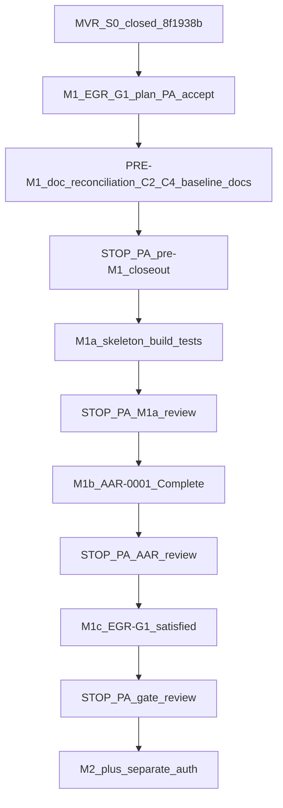

[Home](../../README.md) › [Project Index](../../PROJECT_INDEX.md) › [Handover](README.md) › ProjectConcord M1 / EGR-G1 Implementation Plan

# ProjectConcord M1 / EGR-G1 — Implementation Plan

**M1/EGR-G1 plan:** Project Architect **ACCEPTED** / **PUBLISHED** (`aaa9229212baf12efdf0f97e210fc5287b0d8348` on `origin/main`)  
**Pre-M1 documentation reconciliation:** **CLOSED** / Project Architect **ACCEPTED** / **PUBLISHED** (2026-09-28) — C2, C4, PA-2, canonical handover + index links in commit `aaa9229`  
**Architecture baseline commit (pre-M1 content):** `8f1938ba0adc3fbe933cdb27581e813142bb122f`  
**Working Cursor copy (non-canonical):** `/Users/edbecnel/.cursor/plans/m1_egr-g1_implementation_plan_a088fdc4.plan.md`

**M1a:** **CLOSED** / Project Architect **ACCEPTED** / **PUBLISHED** at `42f5a6e0e0e67d733a096f7a0fe0ef31976c6b6b` on `origin/main`  
**M1b-A:** **COMPLETE** / Project Architect **ACCEPTED**  
**AAR-0001:** **COMPLETE** / Project Architect **ACCEPTED** / **publication authorized** (M1b-B)  
**M1b-B:** **AUTHORIZED** — publication in progress  
**M1 (overall):** **OPEN** — EGR-G1 not satisfied  
**M1c:** **NOT AUTHORIZED**

---

## Project Architect disposition

| Item | Status |
|------|--------|
| Governance sequence (G0 → M1a → PA → M1b AAR → PA → M1c G1 → PA → M2+) | **Accepted** |
| No M1 execution MVR from governing artifacts | **Accepted** |
| **Plan** | **ACCEPTED** / **PUBLISHED** (`aaa9229`) |
| **Pre-M1 doc reconciliation** | **CLOSED** / **PA ACCEPTED** / **PUBLISHED** (2026-09-28; C2, C4, PA-2) |
| **M1a (M1 skeleton)** | **CLOSED** / **PA ACCEPTED** / **PUBLISHED** (`42f5a6e`) |
| **M1b AAR-0001** | **COMPLETE** / **PA ACCEPTED** / **publication authorized** (M1b-B) |
| **M1c EGR-G1 closure** | **NOT AUTHORIZED** |

---

## Recorded PA decisions (PA-1 – PA-13)

| ID | Decision |
|----|----------|
| **PA-1** | **C1 RESOLVED:** M1 = **Implementation Roadmap assembly set only** (six projects + minimum test projects). No empty shells for Validation, Authoring, Relationships, Repository, Git, ChangeAnalysis, Integrity. System Architecture Overview = future destinations; Roadmap = M1 physical set. |
| **PA-2** | **.NET 10 LTS** — TFM `net10.0`. **Avalonia 12 stable** (current 12.x package at implementation time). **Initial baseline** — no existing UI to migrate (see **PA-13**). No .NET 11 RC, no preview .NET/Avalonia. Documented in [Developer Handbook](../Developer_Handbook/01_Development_Environment.md) (pre-M1 reconciliation). |
| **PA-3** | **Do not create `.projectconcord/` in M1** unless open-folder stub has a concrete runtime need for derived/local state. No speculative cache/index. Defer gitignore decision until first milestone that produces derived state. |
| **PA-4** | **No M1 execution MVR.** PA does not add governed manual-QA obligation for M1. **STOP-2 binding.** M1 validation = build/test + AAR/governance review. If obligation emerges later, **STOP** and escalate — do not informal-walkthrough as MVR. |
| **PA-5** | **ADR-0014 remains Proposed** through M1/EGR-G1. G1 does not require Accept. AAR acknowledges Proposed status; SPEC-005/S0 baseline = **placement constraints**, not feature implementation. |
| **PA-6** | **Pre-M1 doc reconciliation:** narrow **C2** ([EGR-G1](../Program/Gate_Reviews/EGR-G1-MVP-Implementation-Gate.md) gate direction) + **C4** ([ADR-0012](../Architecture/ADRs/ADR-0012-Adopt-EDF-Architectural-Audit-Records.md) AAR-0001 requirements basis) + **PA-2** handbook baseline — **executed** 2026-09-28. |
| **PA-7** | **C3 RESOLVED:** AAR-0001 evaluates M1 skeleton against **complete applicable canonical architecture at audit time**, including MVR S0 placement constraints — **architectural conformance ≠ SPEC-005 M2–M5 feature implementation**. |
| **PA-8** | **C5 RESOLVED:** SPEC-001 G1 dependency = full MVP progression; **does not** block G0-authorized M1 skeleton. Sequence: G0 → M1 skeleton → AAR → G1 → MVP. |
| **PA-9** | **C6 RESOLVED for M1:** `run_conformance_validation.sh` unavailable — **not M1 blocker**; remain NOT EXECUTED (not PASS/FAIL); M3 concern. M1 = build/test evidence for skeleton. |
| **PA-10** | **Real minimal tests** — `dotnet test` runs **actual** tests that pass. No meaningless empty placeholders. Test only behavior **implemented** in M1 (see § Tests). No UI automation required unless canonical docs require. |
| **PA-11** | **M1a STOP before AAR:** Do not create AAR-0001 in same run as M1a. PA reviews M1a evidence → **explicit authorization** → M1b → STOP → authorization → M1c. |
| **PA-12** | Repository copy of this plan is the **canonical** governance handover artifact after publication; Cursor `.plan.md` may remain a working copy. |
| **PA-13** | **First Avalonia application at M1a** — repository has no `src/`, no `Edf.Desktop`, no UI today. .NET 10 + Avalonia 12 = **greenfield initial baseline**, not upgrade/migration. **M1a UI:** minimum desktop shell + open-folder/project-root only. **Not authorized:** general UI development; navigation, dashboards, EDF artifact views, ATTENTION, MVR UI, authoring, governance UX (deferred to governed milestones). |

---

## Revised end-to-end sequence



---

## M1a implementation status (skeleton — PA accepted)

| Item | Status |
|------|--------|
| Physical scope | `ProjectConcord.sln`, six `src/Edf.*` projects, `tests/Edf.Application.Tests`, `global.json` (SDK **10.0.401**) |
| Runtime | **net10.0**, Avalonia **12.1.3**, first minimal desktop shell + open-folder / project-root |
| Layering | Desktop → Application → Engine / Identity / ProjectServices → Domain |
| Validation | `dotnet build` / `dotnet test` (Release) — six executable tests |
| **M1 overall** | **Not complete** — AAR-0001 and EGR-G1 remain |
| **M1a publication** | **PUBLISHED** — `42f5a6e0e0e67d733a096f7a0fe0ef31976c6b6b` on `origin/main` |

**Not in M1a:** EDF discovery/parsing, MVR types, `.projectconcord/`, speculative future assemblies. **`ILocalProjectRuntime`** accepted as minimal marker seam for AAR-0001 review in M1b (not expanded in M1a).

---

## M1 minimum physical scope (PA-1, PA-12)

```text
ProjectConcord.sln

src/
    Edf.Domain/
    Edf.Engine/
    Edf.Application/
    Edf.ProjectServices/    # stubs as required by M1
    Edf.Identity/           # local degenerate Administrator seam
    Edf.Desktop/            # FIRST Avalonia app — minimal shell only (PA-13)

tests/
    (minimum coherent test project(s) for real M1 tests — e.g. Edf.*.Tests)
```

**Not in M1:** `Edf.Validation`, `Edf.Authoring`, `Edf.Relationships`, `Edf.Repository`, `Edf.Git`, `Edf.ChangeAnalysis`, `Edf.Integrity`, MVR-specific types, `.projectconcord/` (unless PA-3 STOP exception).

---

## Runtime / UI baseline (PA-2, PA-13)

**Repository context (baseline `8f1938b`):** no `src/`, no `ProjectConcord.sln`, no `Edf.Desktop`, no Avalonia application. M1a establishes ProjectConcord’s **first** application and UI skeleton.

| Setting | Value |
|---------|--------|
| Target framework | **.NET 10 LTS** (initial implementation baseline) |
| TFM | **`net10.0`** |
| UI | **Avalonia 12** stable line (resolve current 12.x package at project creation) — **greenfield**, not migration |
| Excluded | .NET 11 RC, preview .NET, preview Avalonia |

Prerequisites: [Developer Handbook — Development Environment](../Developer_Handbook/01_Development_Environment.md).

### M1a UI scope (in scope vs deferred)

| In scope (M1a) | Deferred (later milestones) |
|----------------|------------------------------|
| Minimum Avalonia **application shell** (launches on macOS) | Navigation systems, semantic browse (M4+) |
| **Open-folder / project-root** interaction required by M1 roadmap | Dashboards, ATTENTION block (M5+ / SPEC-005) |
| MVVM wiring to Application layer for skeleton commands only | EDF artifact views, conformance UI (M2–M3+) |
| | MVR UI, human attestation, authoring interfaces (M5+ / SPEC-005) |
| | Governance / gate UI (post-M5 per SPEC-001 future product) |

Creating **`Edf.Desktop`** is **not** authorization to begin general product UX development.

---

## M1 behavioral scope (skeleton only)

- **First** desktop client: minimal Avalonia shell (PA-13) — not a framework upgrade.
- Application **launches on macOS**.
- **Open-folder / open-project-root** path per [Implementation Roadmap](../Development/Implementation_Roadmap.md) (minimal — not M2 discovery).
- **Layering:** Desktop → Application → Engine/Domain; no EDF rules in Desktop.
- **ProjectServices / Identity:** only to extent required for M1 shell (stubs + degenerate Administrator if implemented).
- **`dotnet build`** succeeds; **`dotnet test`** runs **real** minimal tests and **passes**.
- **No** M2+ parsing, navigation, authoring, validation UI, dashboards, ATTENTION, MVR UI, or other deferred UX (see Runtime / UI baseline table).

---

## Tests (PA-10)

**Principle:** minimal **real** tests, not placeholder `[Fact]` with `Assert.True(true)`.

Plan for tests aligned to **what M1 actually implements**, for example:

- Project/assembly reference or dependency smoke (solution structure).
- Project-root abstraction creation/use (Engine/Application/Domain as implemented).
- Open-project orchestration testable **without UI automation** (Application layer).
- Identity degenerate Administrator behavior **if implemented** in M1.

Do **not** add behavior solely to justify tests. Do **not** require UI automation for M1 unless a canonical requirement says so.

---

## Pre-M1 documentation reconciliation (PA-6) — closed / published

| Item | Action | Status |
|------|--------|--------|
| **C2** | [EGR-G1](../Program/Gate_Reviews/EGR-G1-MVP-Implementation-Gate.md): G0 authorizes M1 **solution skeleton**; **G1** accepts completed M1 skeleton and permits **intensive MVP (M2+)**; explicit governance sequence | **Done** |
| **C4** | [ADR-0012](../Architecture/ADRs/ADR-0012-Adopt-EDF-Architectural-Audit-Records.md) §6: AAR-0001 requirements basis (ADRs, SPEC-001 skeleton, S0 MVR placement / SPEC-005 conformance only) | **Done** |
| **PA-2** | .NET 10 / Avalonia 12 in [Developer Handbook](../Developer_Handbook/01_Development_Environment.md); roadmap/SPEC-001 open questions updated | **Done** |
| **Git publication** | PRE-M1 tranche on `origin/main` | **PUBLISHED** — `aaa9229212baf12efdf0f97e210fc5287b0d8348` |

---

## AAR-0001 (M1b — after M1a STOP + PA authorization)

| Topic | Rule |
|-------|------|
| **When** | Only after **M1a PA review** and explicit **M1b authorization** |
| **Scope** | M1 implementation vs applicable canonical architecture: ADR-0001–0011, SPEC-001 **skeleton**, S0 MVR **placement** (SPEC-005/handover), ADR-0014 **Proposed** acknowledged |
| **Not in scope** | SPEC-005 M2–M5 feature implementation; MVR execution record |
| **Status for G1** | **Complete** before EGR-G1 **Gate satisfied** |
| **File** | [`AAR-0001-m1-solution-skeleton-conformance.md`](../Architecture/Audits/AAR-0001-m1-solution-skeleton-conformance.md) — **Complete** / **PA ACCEPTED** |

---

## EGR-G1 (M1c — after AAR STOP + PA authorization)

**G1 satisfied** requires: M1 skeleton done; **AAR-0001 Complete**; Charter/SPEC-001 reviewed/approved per EGR; ADR-0012 confirmed; gate decision recorded. **Does not** require ADR-0014 Accept.

**G1 satisfied unlocks:** intensive **M2–M5** MVP work — **not** S1 MVR until M2 tranche per roadmap.

**Current gate status:** **Open** — no satisfied decision recorded in this tranche.

---

## Conflict register (C1–C6)

| ID | Status |
|----|--------|
| **C1** | **RESOLVED** — roadmap six + tests only (PA-1) |
| **C2** | **RESOLVED** — EGR-G1 wording amended (PA-6, pre-M1) |
| **C3** | **RESOLVED** — AAR full applicable architecture incl. MVR placement (PA-7) |
| **C4** | **RESOLVED** — ADR-0012 basis aligned (PA-6, pre-M1) |
| **C5** | **RESOLVED** — G0 skeleton vs SPEC-001 G1 dependency (PA-8) |
| **C6** | **RESOLVED for M1** — conformance script not M1 blocker (PA-9) |

---

## MVR / STOP-2 (PA-4)

- **No** `docs/Verification/Records/MVR-NNNN-*.md` for M1.
- **Forbidden in M1:** MvrMarkdownParser, PendingManualQaQuery, write-back, attestation, ATTENTION MVR UI, MVR index, gate MVR consumption, `ManualVerificationRecord` types, execution MVR.
- Generic seams (e.g. open-project command, project root) **without** MVR types OK.

---

## Validation evidence

| Mechanism | Status |
|-----------|--------|
| `analyze_project_structure.sh` | Referenced by EDF; **not present in this repository** — not re-run for pre-M1 tranche unless script is added |
| `run_conformance_validation.sh` | **NOT EXECUTED — SCRIPT NOT AVAILABLE** — not reinterpreted as PASS/FAIL (PA-9) |
| Pre-M1 doc tranche | Internal reference/navigation review; no invented validators |
| `dotnet build` / `dotnet test` | **Passed** at M1a (Release; six tests) |

---

## Governance state (after PRE-M1 publication closeout)

| Item | State |
|------|--------|
| MVR S0 | Closed / PA accepted / **published** `8f1938b` |
| M1/EGR-G1 plan | **PA ACCEPTED** / **PUBLISHED** — `aaa9229212baf12efdf0f97e210fc5287b0d8348` |
| Pre-M1 doc reconciliation | **CLOSED** / **PA ACCEPTED** / **PUBLISHED** (2026-09-28) |
| M1a (M1 skeleton) | **CLOSED** / **PA ACCEPTED** / **PUBLISHED** (`42f5a6e`) |
| M1 (overall) | **Open** — **AAR-0001 Complete** (PA accepted); **EGR-G1** not satisfied |
| M1b-A | **Complete** / **PA ACCEPTED** |
| M1b-B | **Authorized** — publication in progress |
| AAR-0001 | **Complete** / **PA ACCEPTED** / **publication authorized** |
| M1c / EGR-G1 closure | **NOT AUTHORIZED** |
| EGR-G1 | **Open** |
| ADR-0014 | **Proposed** |
| STOP-2 | **BINDING** |
| TRV CC-4B | **PAUSED / UNTOUCHED** |

---

## Related documents

- [EGR-G0](../Program/Gate_Reviews/EGR-G0-Architecture-Planning-Gate.md) · [EGR-G1](../Program/Gate_Reviews/EGR-G1-MVP-Implementation-Gate.md)
- [Implementation Roadmap](../Development/Implementation_Roadmap.md) · [SPEC-001](../Specifications/features/SPEC-001-mvp-edf-desktop-client.md) · [SPEC-005](../Specifications/features/SPEC-005-manual-verification-record-consumption.md)
- [ADR-0012](../Architecture/ADRs/ADR-0012-Adopt-EDF-Architectural-Audit-Records.md) · [ADR-0014](../Architecture/ADRs/ADR-0014-MVR-Human-Attestation-and-AI-Boundary.md)
- [System Architecture Overview](../Architecture/System_Architecture_Overview.md)

## Parent

- [Handover](README.md)
