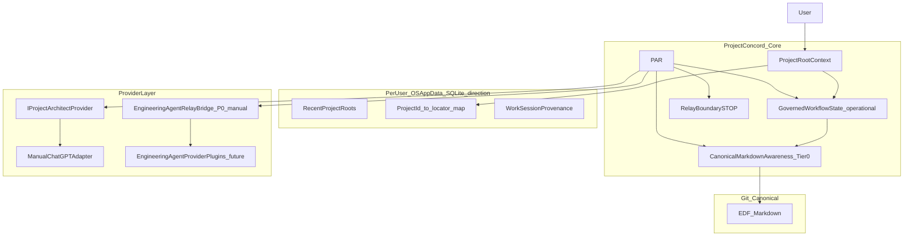
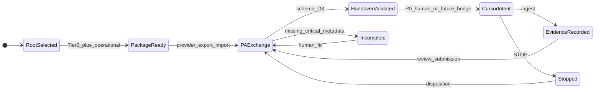

[Home](../../README.md) › [Project Index](../../PROJECT_INDEX.md) › [Handover](README.md) › ProjectConcord PAR Workflow Architecture Plan

# ProjectConcord — PAR / Project Root / Governed Workflow Architecture Plan

## Governance status

| Item | Status |
|---|---|
| **Initial plan** | Cursor PLAN tranche at baseline `c08af261ff323a0ddd54a84bd5c8b990a49fa84f` |
| **Project Architect disposition** | **ACCEPT WITH BINDING AMENDMENTS** (2026-09-28) |
| **Final architecture acceptance (A0)** | **CLOSED / PROJECT ARCHITECT ACCEPTED** (2026-09-28) |
| **A1 implementation plan** | [ProjectConcord-A1-Implementation-Plan.md](ProjectConcord-A1-Implementation-Plan.md) — **CLOSED / PA ACCEPTED / PUBLISHED** (2026-09-28; `fba5be5`) |
| **A2 implementation plan** | [ProjectConcord-A2-Implementation-Plan.md](ProjectConcord-A2-Implementation-Plan.md) — **CLOSED / PA ACCEPTED / PUBLISHED** (A2 P0 manual relay on `main`) |
| **Engineering Agent plugin architecture** | [ADR-0021](../Architecture/ADRs/ADR-0021-Engineering-Agent-Provider-Plugin-Contract.md) — **Accepted** 2026-10-01 (documentation only) |
| **M1 / EGR-G1** | Closed / Satisfied — unchanged |
| **M2+** | **Not authorized** |
| **A3–A4** | **Not authorized for implementation** |
| **Stage 1 architecture** | [AMD-0003](../Architecture/AMD-0003-Core-Domain-Extension-and-Working-Environment-Capability-Model.md) integrated 2026-09-29; [ADR-0016](../Architecture/ADRs/ADR-0016-Core-Domain-Extension-and-Working-Environment-Boundary.md) Accepted — PAR decomposed; A2 reframed in place |
| **ADR-0014** | **Proposed** |
| **STOP-2** | **Binding** |
| **ADR-0013** | **Accepted** 2026-09-29 — Software Development governance ([reconciliation tranche plan](ProjectConcord-ADR-0013-Reconciliation-Documentation-Tranche-Plan.md)) |
| **TRV CC-4B** | Paused / untouched |

## Purpose

Authoritative architecture plan for Project Root lifecycle, stable project identity, per-user application state, Project Architect Relay (PAR), governed workflow relay boundaries, and Cursor/ChatGPT integration **as one workflow architecture**.

This document incorporates **all binding PA amendments** from the 2026-09-28 Plan Amendment Handover. Normative requirements live in [SPEC-006](../Specifications/features/SPEC-006-par-project-root-and-governed-workflow-relay.md); architectural decisions in [ADR-0015](../Architecture/ADRs/ADR-0015-Project-Identity-PAR-and-Per-User-Operational-State.md).

**This tranche authorizes architecture/documentation canonicalization only.**

## Normative ProjectConcord artifacts (post–A0)

| Artifact | Role |
|---|---|
| [SPEC-006](../Specifications/features/SPEC-006-par-project-root-and-governed-workflow-relay.md) | Normative PAR, Project Root, identity, provider boundaries |
| [ADR-0015](../Architecture/ADRs/ADR-0015-Project-Identity-PAR-and-Per-User-Operational-State.md) | Project ID, persistence direction, component boundaries |
| [SPEC-004](../Specifications/features/SPEC-004-ai-assisted-development-governance-workflow.md) | Cross-referenced PC-AIGOV requirements (not duplicated) |
| [ADR-0013](../Architecture/ADRs/ADR-0013-Governed-Development-Workflow-and-Workspace-Model.md) | Software Development governed workflow — **Accepted** 2026-09-29 |
| [Implementation Roadmap](../Development/Implementation_Roadmap.md) | PAR track before M7a |
| [AWI-0006](../Architecture/Watch_Items/AWI-0006-PAR-Cursor-Bridge-Transport.md) | Cursor transport investigation |
| [GAP-043](../Development/EDF_Gap_Register.md), [GAP-044](../Development/EDF_Gap_Register.md) | PAR implementation and bridge gaps |

## Accepted architectural decisions (summary)

### Identity (binding)

- **ProjectConcord Project ID** — stable logical identity for operational/workflow continuity.
- **Project Root** — current filesystem locator only.
- **Repository identity**, **Git remote URL**, **repository/workspace name** — distinct; not interchangeable with Project ID.
- Identity mapping MUST NOT require `.projectconcord/` on open.

### Persistence (architecture direction; not implemented)

- Per-user **SQLite** in OS application data.
- Project-scoped operational partitions keyed by **Project ID**.
- Migration, versioning, recovery documented before A1.

### `.projectconcord/` (binding)

- MUST NOT be created on open/select.
- NOT auto-created by M2.
- Created only when an authorized feature requires project-local derived state (or future explicit user init).

### Provider separation (binding)

```
Governance semantics (Concord/PAR)
        |
        v
   PAR (relay, validation, provenance, STOP at boundary)
        |
        +--> IProjectArchitectProvider (neutral contract)
        |         +-- ProjectArchitectManualAdapter (ChatGPT product today)
        |         +-- OpenAIProjectArchitectAdapter (future)
        |         +-- Other providers (future)
        |
        +--> Engineering Agent relay bridge (P0 manual published)
        |         +-- EngineeringAgentManualRelayBridge (interim reference)
        |         +-- Future: bounded Engineering Agent provider plugins (P1/P2 automated)
```

Core semantics MUST NOT depend on ChatGPT or OpenAI API.

**Architecture reconciliation (2026-10-01):** Normative Engineering Agent integration is defined in [SPEC-006](../Specifications/features/SPEC-006-par-project-root-and-governed-workflow-relay.md) §11 and [ADR-0021](../Architecture/ADRs/ADR-0021-Engineering-Agent-Provider-Plugin-Contract.md). Historical **CursorBridge** references below are **provenance** for A0 planning; automated transport mechanism investigation continues under [AWI-0006](../Architecture/Watch_Items/AWI-0006-PAR-Cursor-Bridge-Transport.md) with Cursor as a **reference P1 candidate** only.

### PCON-0002 / PCR-0001

- PAR architecture proceeds **now**; PCON-0002 is **not bypassed**.
- Provisional transport attribution only until Actor/Role normative model is dispositioned.

### Tier 0 Canonical Markdown awareness

Shallow pre-M2 scope only — see [SPEC-006 §12](../Specifications/features/SPEC-006-par-project-root-and-governed-workflow-relay.md). No competing EDF parser.

### PA handover schema (binding)

**Historical (A0 plan text):** Governance-critical field names included `Cursor-Mode`, `Cursor-Chat`, `ChatGPT-Chat`, and `Cursor-Mode-Transition`.

**Normative (SPEC-006 §9 as implemented in A2):** `Engineering-Agent-Mode`, `Engineering-Agent-Chat`, `ChatGPT-Chat`, `Engineering-Agent-Mode-Transition`; explicit authorization and STOP representation.

Missing critical metadata → **INCOMPLETE** → **no automated Engineering Agent relay**; no silent inference.

### Chat / session provenance (binding)

Core: `ProjectArchitectSession` + `ProjectArchitectSessionAdvisory` (and engineering-agent parallels).

Manual adapter renders `ChatGPT-Chat` / `ChatGPT-Chat-Advisory` (PA) and `Engineering-Agent-Chat` / `Engineering-Agent-Chat-Advisory` (Engineering Agent) for the published P0 workflow.

Provenance chain: observed context → advisory → user decision → requested action → package event. NEW/CONTINUE alone is insufficient.

### Engineering Agent transport

**P0 manual** — **published** (A2): generate, validate, export, import evidence via `IEngineeringAgentRelayBridge`.

**Automated transport** — architecture **Accepted** in [ADR-0022](../Architecture/ADRs/ADR-0022-Engineering-Agent-Automated-Transport-Architecture.md) (2026-10-01); **not implemented**; [GAP-044](../Development/EDF_Gap_Register.md#gap-044--engineering-agent-automated-transport) **closed / resolved**; [AWI-0006](../Architecture/Watch_Items/AWI-0006-PAR-Cursor-Bridge-Transport.md) **closed / satisfied**; plugin contract [ADR-0021](../Architecture/ADRs/ADR-0021-Engineering-Agent-Provider-Plugin-Contract.md); **A4 not authorized**.

### Roadmap

Explicit **PAR track** (A0–A4) **before** M7a; M7a scope not silently pulled forward; tranches independently governed.

## Component architecture



## Workflow state (planning model)



## Implementation staging (accepted planning model)

| Stage | Scope | Authorized |
|---|---|---|
| **A0** | Architecture / canonical documentation | **Complete** — PA accepted |
| **A1** | Per-user app state + Recent Project Roots | **Complete** — published A1a/A1b/A1c; closeout [A1 plan §20](ProjectConcord-A1-Implementation-Plan.md#20-a1-overall-closeout-2026-09-28) |
| **A2** | Manual P0 **governed interaction relay** (Core relay + software package profile + provider transport; historical PAR packaging) | **Complete** — published on `main` |
| **A3** | Governed workflow MVP (manual) | **No** |
| **A4** | Engineering Agent automated transport P1+ ([ADR-0021](../Architecture/ADRs/ADR-0021-Engineering-Agent-Provider-Plugin-Contract.md)) | **No** |
| **M2** | EDF discovery (SPEC-001) | **No** — separate track; feeds Tier 0+ later |

Dependencies: A2+ may consume Tier 0 before M2; deep awareness requires M2+.

## Current-state evidence (baseline `c08af26`)

| Observation | Evidence |
|---|---|
| In-memory Project Root only | `ProjectWorkspaceService` — no persistence |
| No PAR / recent roots | [AAR-0001](../Architecture/Audits/AAR-0001-m1-solution-skeleton-conformance.md) Finding 14 — not an M1 defect |
| PA-3 honored | No `.projectconcord/` in M1 |
| `ILocalProjectRuntime` marker | Future project-local seam — not identity store |

## ADR-0013 (current state)

[ADR-0013](../Architecture/ADRs/ADR-0013-Governed-Development-Workflow-and-Workspace-Model.md) is **Accepted** (2026-09-29). Software Development operational entities (DevelopmentWorkAuthorization, handover packages, submissions, and related **B-layer** artifacts) remain the **target model** for **A3+** and M7a. SPEC-006 governed interaction packages are **derived/operational** per ADR-0013 §1.

PAR track delivers **relay and identity foundation** earlier than M7a UI breadth. **PCON-0002** remains **Proposed**; it did **not** block ADR-0013 or SPEC-006 acceptance (provisional transport attribution per SPEC-006 §13).

*Historical note (A0 tranche, 2026-09-28): ADR-0013 was not yet Accepted when this plan was first validated; see [Validation performed (A0 documentation tranche)](#validation-performed-a0-documentation-tranche) below.*

## Validation performed (A0 documentation tranche)

| Check | Result |
|---|---|
| No `src/` feature implementation | Confirmed — docs only |
| No `tests/` implementation changes | Confirmed |
| No A1–A4 / M2 authorization introduced | Confirmed |
| No `.projectconcord/` creation behavior specified on open | Confirmed in SPEC-006 / ADR-0015 |
| No Cursor bridge / SQLite implementation | Confirmed — direction only |
| No OpenAI API assumption | Confirmed — provider boundary |
| STOP-2 binding preserved | Confirmed |
| ADR-0014 remains Proposed | Confirmed |
| ADR-0013 not accepted | **Historical (A0 only)** — ADR-0013 **Accepted** 2026-09-29 |
| PCON-0002 dependency visible | Confirmed §PCON-0002 above |

## Appendix A — Requirements traceability (handover items 1–18)

| # | Handover requirement | Normative | Architecture decision | Operational/derived | Staging |
|---|---|---|---|---|---|
| 1 | Project Root lifecycle | PC-PAR-005–008 | ADR-0015 §1, §3 | Recent roots in per-user store | A1 |
| 2 | Recent Project Roots | PC-PAR-007–008 | ADR-0015 §2 | SQLite recent list | A1 |
| 3 | Per-user application state | PC-PAR-009–011 | ADR-0015 §2 | DB schema TBD | A1 |
| 4 | Project-local state boundaries | PC-PAR-006; ADR-0004 | ADR-0015 §3 | `.projectconcord/` only when justified | A2+ / feature tranches |
| 5 | Governed workflow state | SPEC-004 PC-AIGOV-002–004 | ADR-0013 (**Accepted** 2026-09-29) | Operational partition by Project ID | A3 / M7a overlap |
| 6 | Canonical Markdown awareness | PC-PAR-T0 §12 | ADR-0015 §5 | Tier 0 snapshots | A2+; deep M2+ |
| 7 | PAR | PC-PAR-012–015 | ADR-0015 §4 | Package records | A2 |
| 8 | Engineering Agent relay / provider plugins | PC-PAR-022 | ADR-0021; AWI-0006 | P0 manual artifacts | A2 P0 **published**; A4 P1+ **not authorized** |
| 9 | PLAN/AGENT/DEBUG routing | §9 schema + PC-PAR-022 | — | Validated handover fields | A2 |
| 10 | Evidence/result ingestion | PC-PAR-012; PC-AIGOV-008 | — | Submission correlation IDs | A2–A3 |
| 11 | PA package preparation | PC-PAR-012 | Provider boundary §8 | Export bundles | A2 |
| 12 | PA-to-Engineering Agent relay | PC-PAR-014, 022 | Relay bridge + plugins | P0 human relay | A2 **published** |
| 13 | STOP enforcement | PC-AIGOV-007; SPEC-006 §14 | — | Relay boundary flags | A2–A3 |
| 14 | Independent Engineering Agent session lifecycle | PC-PAR-021 | Core session model | EngineeringAgentSession | A1–A2 |
| 15 | Independent ChatGPT chat lifecycle | PC-PAR-021; §8 | Manual adapter rendering | ProjectArchitectSession | A1–A2 |
| 16 | NEW/CONTINUE advisory | §9 advisories | — | Advisory records | A1 |
| 17 | New-chat context packaging | PC-AIGOV-015; PC-PAR-021 | Tier 0 bounds | Package bundles | A2 |
| 18 | PA handover metadata validation | §9; PC-PAR-013–015 | INCOMPLETE rules | Validator | A2 |

**SPEC-004 mapping (representative):** 1–5 → PC-AIGOV-002–004, 015; 7–13 → PC-AIGOV-005–008, 007, 016; 10–11 → PC-AIGOV-008, 016. Full PC-AIGOV set remains in SPEC-004 for M7a breadth.

## Appendix B — Evidence package index

| Item | Location |
|---|---|
| Baseline commit | `c08af261ff323a0ddd54a84bd5c8b990a49fa84f` |
| M1 conformance | [AAR-0001](../Architecture/Audits/AAR-0001-m1-solution-skeleton-conformance.md) |
| M1 PA decisions PA-3, STOP-2 | [M1 plan](ProjectConcord-M1-EGR-G1-Implementation-Plan.md) |
| Prior integration analysis | [AI Governance Workflow Integration Analysis](../Architecture/AI_Governance_Workflow_Integration_Analysis.md) |
| Orchestration discovery | [PCON-0004](../Architecture/PCON-0004-Primary-Orchestration-UI-and-External-Engineering-AI-Integration.md) |
| Continuation independence | [PCON-0003](../Architecture/PCON-0003-Governed-Pause-Continuation-and-Resume.md) §7 |
| Cursor working plan (non-authoritative) | `.cursor/plans/par_workflow_architecture_fe62cc01.plan.md` |

**Working copy**

Detailed iteration may exist in Cursor `.plan.md` files. **This repository document** is the persistent record after PA amendment incorporation (mirrors [MVR plan](ProjectConcord-MVR-Adoption-Architecture-Plan.md) pattern).

## Deferred architecture requirements (not authorized for design or implementation)

The following are **prospective** PAR-track requirements only. They do **not** authorize implementation in A1 or A1 closeout.

### Human-interactive verification workspaces (EDF DVW-0001 v1.1)

[GMR-0002](https://github.com/edbecnel/Engineering-Documentation-Framework) (EDF) refined EDF **DVW-0001** to v1.1. Future ProjectConcord human-interactive MVRs should follow DVW-0001 v1.1 and prefer **short, recognizable, readily navigable** disposable paths where practical. Completed A1c DVW evidence (including platform-generated session paths) remains **unchanged**.

### Architect ↔ developer interaction and delegated authority

EDF governance should distinguish **genuine architectural/governance gates** from **AI-orchestration checkpoints** caused by separate agent contexts. Future architecture must support **delegated authority envelopes** so an accepted implementation plan can authorize implementation autonomy within defined constraints, with escalation on architectural boundary crossings, deviations, unresolved decisions, or required governance gates.

ProjectConcord must **not** hard-code one architect/developer interaction model. Appropriate governance guardrails, delegated authority, escalation conditions, and interaction/checkpoint intensity must ultimately be **user-configurable**, while preserving non-negotiable governance and evidence invariants.

## Parent

- [Handover](README.md)

## Related Documents

- [SPEC-006](../Specifications/features/SPEC-006-par-project-root-and-governed-workflow-relay.md)
- [ADR-0015](../Architecture/ADRs/ADR-0015-Project-Identity-PAR-and-Per-User-Operational-State.md)
- [Implementation Roadmap](../Development/Implementation_Roadmap.md)
